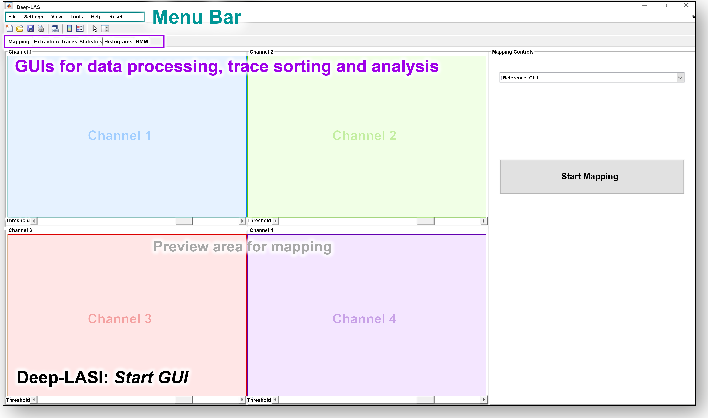
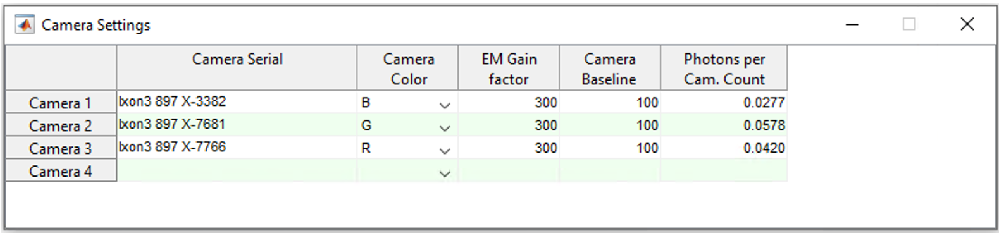
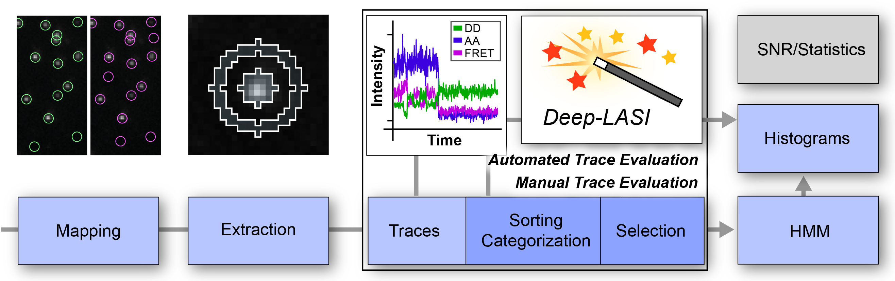

.. |br| raw:: html

    

.. toctree::
   :maxdepth:2
   :hidden:

   documentation
    .. toctree::
        :maxdepth:2
        :hidden:

        docu/data
        docu/opening

   manual_analysis
   automatic_analysis

-----------------------------------------------

Documentation
=====

.. _documentation:

*Deep-LASI* comes with an interactive graphical user interface (GUI) to perform processing and analysis tasks during the data evaluation. This page serves for documenting its functionalities. *Deep-LASI* comes with six integrated GUI sub-windows for analyzing the data and one menubar for handling the data reading, the settings of the program, and simulating single-molecule data. The analysis-GUIs are dedicated to (1) opening and molecule identification, (2) mapping and trace extraction, (3) trace categorization, selection, trace correction/analysis, (4) SNR analysis of traces, (5) the summary of the results including FRET, States, correction factors and TDP plots, and (6) the classical HMM analysis via different software packages.

To start learning how to use *Deep-LASI*, we recommend, first, reading through the :doc:`starter` and :doc:`example` sections. 
A step-wise description of how to analyze different single-molecule data with *Deep-LASI* is given for selected showcases in the :doc:`example` in detail.

Overview
------------------
- :ref:`data-format`
- :ref:`opening`
.. - :ref:`mapping`
.. - :ref:`extraction`
.. - :ref:`manual_analysis`
.. - :ref:`man-categorization`
.. - :ref:`man-selection`
.. - :ref:`hmm`
.. - :ref:`histograms`
.. - :ref:`statistics`
.. - :ref:`auto-analysis`

--------------------------------------------------------------------
.. Contains section on Data requirements ..
.. include:: docu/data.rst

--------------------------------------------------------------------
.. Contains section on Processing single molecule data ..
.. include:: docu/opening.rst

--------------------------------------------------------------------
..  _opening:
Processing Single-Molecule Data
-------------

Starting Deep-LASI
~~~~~~~~~~~~~~~~~
To evaluate your experimental data with *Deep-LASI*, please open the program from the MATLAB command window by typing in :code:`>> DeepLASI`. It will open the core-program responsible for data import, trace extraction, as well as and manual selection and sorting. After a couple of seconds, the Start-GUI of the program will open as shown in :numref:`open-program`.

   The Main-GUI of Deep-LASI has six sub-windows for data processing and analysis.

Deep-LASI shows one empty Main-GUI together with six integrated sub-windows for analyzing the data and one menubar for handling the data reading, the settings of the program, the simulation of single-molecule data and training of (new) neural networks.

Menu Bar
~~~~~~~~~~~~~~~~~
Basic functionalities of *Deep-LASI* such as data handling, program settings, or the training of new neural networks for data analysis are controlled via the *Menu Bar*. It has the following five drop-down menus

..  csv-table:: Menu Bar Entries
   :widths: 15, 200

   *File*,   "Functions for loading, mapping, processing, saving, importing and exporting data"
   *Settings*,"Access to Camera Settings"
   *View*,   "Appearance of the GUI, Graphs and Data representation"
   *Tools*,  "Programs for accessing/simulating single-molecule data, and training Neural Networks"
   *Help*,   "Direct link to the Documentation in case of problems"
   *Reset*,  "Restart of Deep-LASI and clearance of all variable of the program"

**Dropdown Menu File.** |br|
The dropdown menu *File* (:numref:`file-menu`) controls all steps, starting from loading the experimental data, over mapping and background correction, to trace extraction and saving of traces. Moreover, it facilitates data import and export in different formats, as described in the :ref:`data-format` section. The dropdown menu hosts seven sub-routines:

#. The sub-routines in **Mapping** are used to match the corresponding image pixels between up to four different cameras. They allow the user to generate, save and reload maps containing the transformation matrices between the channels. A description of how to map the detection channels is given below in the :ref:`mapping` section.

#. **Load Image Data** facilitates the read-in of data files per detection channels. The data needs to be read in consecutively, starting with Channel 1 being the most 'blue'-shifted detection channel and Channel 4 being the most 'red'-shifted detection channel. Data loading is possible for a single file per channel, but also for multiple files at once. Please make sure: (1) that the numbers of loaded files per detection channel match and (2) that the files have consecutive numbering so that corresponding movies are loaded.

#. Using the **Load Traces/State** routine, previously extracted and potentially already evaluated traces can be reloaded into *Deep-LASI*.

#. The **Add Traces/State** routine allows the addition of further extracted traces to already loaded traces. This function is especially useful for merging trajectories from various measurements. Please note that only traces with identical experimental settings (e.g., number of frames, exposure time, or laser excitation) can be merged.

#. **Save Traces/State** to save desired changes on traces, for example, if you have already carried out all analysis steps.

#. The **Import** function allows loading data sets from other single-molecule measurements (as described in the :ref:`data-format` section above). The imported traces are only loaded and not further modified by *Deep-LASI*.

#. **Export** allows for transferring extracted traces to a former analysis software used by the hosting group and to save and export traces and enables the saving of single trajectories in graphic formats.

#. **Quit** terminates the program.

.. figure:: ./../figures/documents/Fig_3_Open_Mapping_Menu.png
   :width: 300
   :alt: Open mapping menu
   :align: center
   :name: file-menu

   *Deep-LASI* file menu

**Dropdown Menu Settings.** |br|
The dropdown menu *Settings* (:numref:`settings-menu`) opens a sub-window for entering the camera hardware settings chosen in the experimental setup. The routine asks for the EM Gain factor, the camera baseline in dark counts, and the number of photons per camera count for each camera. With this, *Deep-LASI* can convert/display the determined intensity instead of arbitrary units in Counts per second, i.e., in Hertz.

   *Deep-LASI* settings menu

**Dropdown Menu View.** |br|
The third dropdown menu *View* controls the appearance and settings of the graphical interfaces on the different GUI sub-windows of Deep-LASI. |br|
The sub-tab *Colormap* changes the color palette in 3D plots, e.g., on the Trace GUI surface (which shows small zoomed-in areas of 24x24 pixels) or the Extraction GUI surface (which shows the average projection of localized molecules). In both cases, localized molecules are highlighted. The default colormap is *jet*, which can be exchanged by other standard color maps from MATLAB. |br|
The *Plot Units* sub-tab controls the y-axis of the intensity and FRET panels for individual single-molecule trajectories. Checking/unchecking the different sub-tabs immediately updates the graphical interface and the way how a single-molecule trace is displayed. The sub-tab **Plot Units** provides the following seven different settings for displaying intensities and FRET trajectories:

..  csv-table:: Plot Units Entries
   :widths: 15, 200

   *Photons (Cam. calibrated)*,   "Intensity is shown as the absolute number of photons"
   *Mean across Particle Mask*,  "Intensity is shown as mean intensity within the detection mask"
   *QY/Det. Eff (gamma)*,         "Intensity after gamma correction"
   *Spectral crosstalk (beta)*,   "Intensity after correction against spectral crosstalk"
   *Direct Excitation (alpha)*,   "Intensity after correction against direct excitation"
   *Raw Trace (no BG subtr.)*,    "Intensity without background correction"
   *Corrected FRET*,              "Display of accurate FRET instead of apparent FRET"

.. tip:: @ Simon, what precisely is plotted, i.e. which axis is changed and how ??

#.  The first sub-tab, **Photons(Cam.calibrated)**, converts the intensity axis into the absolute number of photons being detected by the individual cameras during a particular excitation cycle. It updates the intensity axis of extracted single-molecule traces on the *Traces GUI$ window.
#.  The second sub-tab, **Mean Across Particle Mask**, shows the mean emission intensity of the particle within the detection mask after trace extraction on the y-axis of the single-molecule traces on the *Traces GUI$ window.
#.  The next three sub-tabs serve to correct and show the intensity after correction against direct excitation (**Direct Excitation (alpha)**), spectral crosstalk (**Spectral crosstalk (beta)**) or QY and detection sensitivity (**QY/Det. Eff (gamma)**), respectively. Without determining the correction factors, *Deep-LASI* provides identical plots for the corrected and uncorrected intensities.
#.  The penultimate sub-tab, **Raw Trace (no BG subtr.)**, activates the display of uncorrected, raw intensity traces, i.e., without background subtraction.
#.  If the last option, **Corrected FRET**, is selected, *Deep-LASI* shows Accurate FRET efficiencies for each single-molecule trajectory in case the FRET correction factors have already been determined. Otherwise, the displayed FRET values between Accurate and Apparent FRET are identical.

**Dropdown Menu Tools.** |br|
The fourth dropdown menu *Tools* opens the subpanels for simulating single-molecule traces and training of neural networks. A detailed description of its functionalities, workflow, and usage is given in the :doc:`sim` Chapter.

**Dropdown Menu Help.** |br|
In the case of problems or errors, help can be found in the dropdown menu *Help*, which provides a direct link opening this Online documentation of Deep-LASI.

**Dropdown Menu Reset.** |br|
When finishing the analysis of one data set, a change to a new data set can create errors, in particular, if they differ with respect to laser alternation, imaging modalities, or the number of emitters. In this case, please reload the program via the *Reset* button. DeepLASI will reset all temporal variables in the background, refresh the graphical interface and restart the program.

Main-GUI
~~~~~~~~~~~~~~~~~
Data-analysis with *Deep-LASI* involves consecutive working steps (:numref:`main-workflow`), which are accommodated in six different sub-GUIs. The Starting-GUI incorporates single molecule data at different levels. First of all, it reads movies from emCCD or sCMOS cameras, as usually acquired using a wide-field total internal reflection fluorescence (TIRF) microscope and maps corresponding pixels between camera onto each other (see section on  :ref:`mapping`). Next, it extracts the intensity information of single and co-localizing molecules depending on the excitation scheme and assay and saves the extracted traces afterwards, as described in more details in section :ref:`extraction`. For already recorded intensity time traces from confocal microscopy and localization microscopy, *Deep-LASI* imports the trajectories as formerly saved without additional correction. Equally, already extracted traces can be loaded into Deep-LASI for further data analysis.

   Workflow summarizing the generic data formats used by *Deep-LASI*, as well as supported data formats for trace import.

The main data handling is carried out on the *Traces* GUI (:numref:`main-workflow`). Here, you can choose between manual or automated data analysis. Conventional data analysis, includes sorting, categorization and trace preparation (as described in section :ref:`manual_analysis`) before handing over the preselected traces for Hidden-Markov modeling on the *HMM* GUI followed by dwelltime analysis and TDPs. The Sub-Window *Histograms* allows for summarizing the analyzed data via histograms with respect to, e.g., frame-, molecule-, and state-wise histograms, or the global FRET correction factors (:numref:`main-workflow`). The sub-window *Statistics* on selected molecule groups with respect to, e.g., average brightness, background, SNR etc. |br|
The automated data analysis is carried out on the *Traces* GUI, which includes and automated selection, sorting, and categoriziation process prior to an automated kinetics analysis based on deep-learning. The data is afterwards automatically summarized by state-of-the-art dwell-time analysis and TDPs.

.. Overview
.. ------------------
.. - :ref:`data-format`
.. - :ref:`opening`
.. - :ref:`mapping`
.. - :ref:`extraction`
.. - :ref:`man-categorization`
.. - :ref:`man-selection`
.. - :ref:`hmm`
.. - :ref:`histograms`
.. - :ref:`statistics`
.. - :ref:`auto-analysis`

--------------------------------------------------------

..  _mapping:
Mapping
~~~~~~~~~~~~~~~~~

If mapping is required between two or more cameras, go to **Mapping** from the menu under file. Then choose ‘Create New Map’ and the ‘First Channel’. You can see the path on figure 3.

.. figure:: ./../figures/documents/Fig_3_Mapping_Menu.png
   :width: 600
   :alt: Open mapping menu
   :align: center
   :name: mapping menu

   Mapping menu

Now the program will ask you to choose a file which could be an image or a series of images as a video file usually taken from a calibration pattern like a zero-mode waveguide. After choosing the file, the image gets open together with some adjusting options, like figure 4.

.. figure:: ./../figures/documents/Fig_4_Map_Image_Uploading.png
   :width: 450
   :alt: map uploading
   :align: center
   :name: mapping image uploading

   Uploading first mapping image

On the window opened for the user, you can use the **Channel Layout** to take the desired field of view. You can take the whole area or select a specific region with the buttons provided for that. There are also the options of rotating or flipping the image, so that all images from various cameras show the same pattern. Then click on OK. The image will be open on the mapping tab, figure 5.

.. figure:: ./../figures/documents/Fig_5_Map_Image_Detecting.png
   :width: 400
   :alt: map detection
   :align: center
   :name: mapping image detection

   Mapping image loaded to *Deep-LASI*

With the threshold bar, make sure that enough points are circled and detected by the program. Then continue opening images from other detectors with the same procedure, as shown on images 6 and 7.

.. figure:: ./../figures/documents/Fig_6_Map_Second_Channel.png
   :width: 300
   :alt: second map image
   :align: center
   :name: opening second mapping image

   Opening the second mapping image

.. figure:: ./../figures/documents/Fig_7_Map_Second_Uploading.png
   :width: 400
   :alt: second map uploading
   :align: center
   :name: second map uploading

   Adjusting the image for the second mapping image

After opening the mapping images from all the cameras, select which channel you prefer to be the reference channel, like figure 8. In most cases, the first channel is taken as the reference one unless you have a special mapping plan.

.. figure:: ./../figures/documents/Fig_8_Mapping_Starting.png
   :width: 450
   :alt: start mapping
   :align: center
   :name: start mapping

   Performing the mapping step

Then click on **Start Mapping**. The mapping process goes quit fast and gives the mapping result as before and after images like figure 9. It is recommended to check the quality of mapping. In some cases you might have to take new images for this step if the image quality you uploaded was not acceptable which is a rare event!

.. figure:: ./../figures/documents/Fig_9_Map_Before_After.png
   :width: 350
   :alt: check mapping
   :align: center
   :name: before and after mapping

   Mapping result showing the channels overlay before and after mapping

After mapping, the extraction tab opens showing a detection mask created like the one shown on the top right part of figure 10. This mask is used to calculate the emission intensity of the particle inside the central circle, and also the background within the outer ring. The user has the freedom to change the mask settings when needed. You have the option of saving the created map or loading a previous map from the same mapping menu.

.. figure:: ./../figures/documents/Fig_10_Map_Saving.png
   :width: 400
   :alt: created mask
   :align: center
   :name: created mask after mapping

   The mask created after mapping with adjustment options

..  _extraction:
Loading the data
~~~~~~~~~~~~~

Now you can open the data files from file menu and **Load Image Data** similar to opening the mapping images like shown on figure 11. The order of channels should be the same as mapping order.

.. figure:: ./../figures/documents/Fig_11_Data_Loading.png
   :width: 300
   :alt: loading first channel
   :align: center
   :name: loading first channel data

   The menu for loading image data

*Deep-LASI* asks you to choose the data files, and you can open all the files from each channel at a time. After a short time, the following window (figure 12) will open to take the measurement parameters. The first box is for the sum of exposure time and frame transfer. For example in case of measuring with the exposure time of 50 ms, and the frame transfer of 2.2 ms, we can enter 52.2.

.. figure:: ./../figures/documents/Fig_12_Measurement_Parameters.png
   :width: 400
   :alt: inserting measurement parameters
   :align: center
   :name: measurement parameters

   The window for specifying measurement parameters and excitation scheme

The second box is to get the ALEX sequence used for illuminating the sample. Different combinations of two or three laser excitation can be entered here. Note that for the IR laser, you should only enter the letter ‘I’. The letter ‘G’ works for lasers in green or yellow region. Then you put the slider on the corresponding channel, for example, on the image shown here on the left or right position depending on reading data from first or second channel. It gets three divisions in case of a three-channel experiment.

Then choose which frames you want to load on the program by using the **Load frame range**. Also depending on the experiment, you can choose the range of desired frames for detecting the particles and extracting their intensity traces. *Deep-LASI* takes all the frames by default and you can change them as you wish.

The option of choosing the dye does nothing at the moment, but a library of various dyes could be added to the program so that dye specific information help us with a more complete analysis.

As the last step here, click on the corresponding channel color from the four options provided. Now *Deep-LASI* opens the first data file from the range that you selected, like figure 13.

.. figure:: ./../figures/documents/Fig_13_Detecting_Particles.png
   :width: 400
   :alt: first channel detection
   :align: center
   :name: particles detection

   Particle detection for the first channel data

The sliders below the image are to adjust the display contrast, and detection threshold so that one gets more particles detected. The detected particles are inside a triangle within the image, and the number of them is shown in the box next to the image on the top right position.

Continue opening the data images for the next channel(s) from the same menu, as shown on figure 14.

.. figure:: ./../figures/documents/Fig_14_Data_Loading_Second_Channel.png
   :width: 300
   :alt: loading second channel
   :align: center
   :name: menu for loading second channel

   Loading data from the second detector

Each time you load image files, the pop-up window appears asking you about the channel color to extract the data in the correct order.

.. figure:: ./../figures/documents/Fig_15_Measurement_Parameters_Second_Chan.png
   :width: 300
   :alt: inserting second measurement parameters
   :align: center
   :name: change parameters for the next detector

   Updating measurement parameters for the next channel

The example figures show a two-color measurement. As shown on figure 15, we put the slider on the second half to indicate the second channel (the same procedure works for the third channel by putting the slider to the most right position.), and also click on the R to indicate the acceptor channel (red in this case). After a short time the first frame of the second channel overlays on the image from the first one.

.. figure:: ./../figures/documents/Fig_16_Detecting_Colocal.png
   :width: 400
   :alt: detection of co-localization
   :align: center
   :name: finding co-localization

   Detection of particles and their co-localization

The color of triangles show the detected emitters on each corresponding channel and the circles show the co-localized particles. All the numbers are also reported in the small box on the top.

You can decide which particles you want to analyze using the options in the right box **Trace Selection** and then click on **Extract Traces**. In the example shown on figure 17 only the co-localized particles are considered to study their FRET.

.. figure:: ./../figures/documents/Fig_17_Extracting_Start.png
   :width: 450
   :alt: start extraction
   :align: center
   :name: performing the extraction

   Starting the extraction of intensity traces

..  _manual_analysis:
Manual data analysis
-------------

Intensity Traces
~~~~~~~~~~~~~~~~~~~~

After the extraction step which might take a while depending on the amount of data loaded, the resulting traces will open on the next tab called **Traces** as shown on figure 18 for both two- and three-color measurements. You can see on the left side that 6100 two-color traces were extracted from the loaded data set.

.. figure:: ./../figures/documents/Fig_18_Trace.png
   :width: 700
   :alt: trace
   :align: center
   :name: trace look

   Exemplary traces for a two-color measurement on the left, and three-color on the right

On figure 18 on the left, you see the time trace of both donor and acceptor in the left upper panel. Because of illuminating the sample using ALEX mode, a lot of information are available on each trace. The gray plot is the total intensity on the donor channel which in theory is expected to have a stable value before a bleaching step. The green trace is the signal of donor after donor excitation, the red trace is the emission of acceptor after donor excitation (FRET), and the dark red is the emission of acceptor after acceptor excitation. You can choose which intensity trace be shown from the right box **Plot Layout** by checking or unchecking the corresponding boxes.

The lower panel in orange, is the time trace of FRET efficiency. You can also choose which efficiency trace to see. It especially comes handy in case of having more than one FRET pair like the case shown on the right part. In the middle column, the detected particle on each channel is shown inside the detection mask, and in addition to the trace information this can also help to decide if we have a single molecule or not. For example you should see one emitter in the middle and no particle sitting on the background ring, since it will falsify the background calculation.

For a three-color measurement, you will get an additional panel. As shown on figure 18 on the right, the top panel consists of all the intensities after the blue excitation in the blue channel. So the dark blue is the emission of the blue dye after blue excitation, the light blue is the emission of green dye after the blue excitation, and the purple trace is the emission of red dye after blue excitation. The rest of the panels are the same as described before.

With the **navigation** slider you can go through all traces, and with the **classification** part, you can manually categorize your traces into several categories based on your analysis needs, see an example on figure 19. All traces are by default in the **Uncategorized** section, by clicking on the plus sign you can add more categories, rename, and also assign keyboard letters to transfer them to a corresponding category by simply pressing the assigned key.

.. note:: You can not assign the letters **A**, **D**, or **E** to your categories. These are the keys that you can use to go to the previous trace (A), the next trace (D), and have the program select analysis region for you (E).

You can also delete an unwanted category with the trash can icon or uncheck the filter box to prevent them being visible. It is especially helpful for the trash category for example. When you assign a trace to a specific category, it will be automatically removed from the first **Uncategorized** one.

.. figure:: ./../figures/documents/Fig_19_Categories.png
   :width: 300
   :alt: categorization options
   :align: center
   :name: categorization table

   Navigation and categorization box

For selecting the desired region on each trace for further analysis, you can drag the mouse to make the selected region shadowed, for example from the beginning of a trace until a bleaching step. By clicking on the trace region, the mouse turns to an active cursor for a general selection for example when all the dyes are active. *Deep-LASI* will use the first bleaching step to calculate the correction factors. If you want to select channel specific regions, press the numbers 1,2,… to indicate the channel with the same order you loaded the images, and then you can select the region by the cursor special to each channel like the example on figure 20 for the red channel as the second one. For other channels the cursor shows the other corresponding letters like B, G, and I.

.. figure:: ./../figures/documents/Fig_20_Cursor_Activating.png
   :width: 400
   :alt: cursor example with two color trace
   :align: center
   :name: example of activated cursor

   Activated cursor specific for red channel for regio selection

The next photo shows an example of region selection for both green and red channels. Here the FRET efficiency trace gets the selection until the first bleaching step, and this region will be added to the FRET histogram in the end.

The correction factors calculated from each trace are in the **FRET control** box on the lower right corner. If a trace is not suitable for calculating the correction factors, then the median value of the whole data set would be applied on that.

.. figure:: ./../figures/documents/Fig_21_Correction_Factor_Table.png
   :width: 450
   :alt: correction factor box
   :align: center
   :name: correction factor box

   Correction factors based on the selected region on a trace

After having all the traces categorized, you can move on to the **Histograms** tab (figure 22), choose the category you want which are the same as you defined (figure 23), and get information about your data as histograms already fitted. Information such as the total signal, background level, count-rate, signal to noise ratio, and bleaching time, figure 24. The fitting results are provided in a table on the right side.

.. figure:: ./../figures/documents/Fig_22_Histogram_Tab.png
   :width: 300
   :alt: histogram tab
   :align: center
   :name: histogram tab

   Histogram tab

.. figure:: ./../figures/documents/Fig_23_Histogram_Tab_Categories.png
   :width: 300
   :alt: same categories in histogram tab
   :align: center
   :name: same categories in histogram tab

   Categories shown on *Histogram* tab

.. figure:: ./../figures/documents/Fig_24_Measurement_Histograms.png
   :width: 450
   :alt: histograms showing measurement details
   :align: center
   :name: histograms showing measurement details

   Histograms showing measurement details

Then you can move on to the **FRET** tab, and again choose the desired category by clicking on the plus sign beside the list.

.. figure:: ./../figures/documents/Fig_25_FRET_Tab.png
   :width: 300
   :alt: FRET tab
   :align: center
   :name: FRET tab

   FRET tab on the GUI

.. figure:: ./../figures/documents/Fig_26_FRET_Tab_Categories.png
   :width: 500
   :alt: FRET tab categories
   :align: center
   :name: choosing categories on FRET tab

   Choosing desired category(ies) on *FRET* tab

After choosing the category, you can select from the **Plot Mode** which plot to get. In the example shown on figure 26, you get the histogram of apparent FRET efficiency, like the one in figure 27.

.. figure:: ./../figures/documents/Fig_27_Result_Histogram.png
   :width: 400
   :alt: apparent FRET histogram
   :align: center
   :name: apparent FRET histogram

   An exemplary histogram of apparent FRET efficiency with two populations

There are options in **Display Settings** (see figure 28) to make the frame-wise and/or molecule-wise plot visible, normalize them, and also to fit them by choosing the best fitting method. If sometimes fitting seems so wrong, you can manually insert some values based on what you roughly see on the plot, fix them and fit again. By playing around the fitting gets better, then you can uncheck the fixing boxes and let the program find the best fitting values. You can also change the color of your plot(s) by clicking on the colored rectangle and choose a desired color.

.. figure:: ./../figures/documents/Fig_28_Fitting_Histogram.png
   :width: 500
   :alt: display settings
   :align: center
   :name: result display settings

   Display settings for the resulting plots

On the HMM tab, you can again select a category and run the HMM on it. This option works for two-color measurements at the moment. There are some other options for analysis the kinetics of a three-color measurement which will come shortly in the following parts.

.. figure:: ./../figures/documents/Fig_29_HMM_Tab.png
   :width: 300
   :alt: HMM tab
   :align: center
   :name: HMM tab

   HMM tab on the software GUI

.. figure:: ./../figures/documents/Fig_30_HMM_Starting.png
   :width: 450
   :alt: starting HMM
   :align: center
   :name: running HMM

   Starting HMM analysis on data

..  _automatic_analysis:
Automated Analysis by Deep Learning
-------------

In case you want to save time and not go through all the analysis steps manually which might take days and even weeks especially for categorizing, you can use the automated analysis provided in the **Deep Learning** tab, Figure 31. This is an additional program using pre-trained deep neural networks incorporated into *Deep-LASI*.

.. figure:: ./../figures/documents/Fig_31_TracesTab.png
   :width: 400
   :alt: Deep learning tab
   :align: center
   :name: Deep learning tab

   The automated analysis tab, **Deep Learning**

The simplest way to get your final results is to click on **Magic Button** (figure 32) and the program will do all the steps of categorization, correction, and dynamics analysis for you! All neural network models are chosen automatically dependent on the number of channels in your data set. The first step is the categorization of all traces. Note, that only dynamic traces reaching the confidence threshold (editable the deep learning tab) will be included in the category 'Dynamic (filtered)' and further analyzed. The **Magic Button** simply calls a series of functions which you also have access to individually, namely **Categorize Traces**, **Autocorrect**, **Number of States** and **State Transitions**. For the prediction of state transitions you have more freedom if you call the function separately. For example, you can run the prediction on fully corrected data, choose a specific model in case you have prior knowledge about the system or feed all frames into the state classifier without prior categorization of the trace classifier.

.. figure:: ./../figures/documents/Fig_32_DeepLearning_Tab.png
   :width: 300
   :alt: magic button
   :align: center
   :name: magic button

   Deep Learning Tab with Magic Button

After trace classification, auto calculation of all available correction factors is performed. Figure 33 shows the histograms of the extracted direct excitation, crosstalk and gamma factors with the corresponding median, mean, and mode values. Gamma factors are calculated 3-fold for median, mean and mode values of direct excitation and crosstalk to show you the influence of these globally used correction factors on the gamma factor. The total number of traces and frames used for the calculation of each correction factor is displayed above the histograms.

.. figure:: ./../figures/documents/Fig_33_ct_dir_autocalc.png
   :width: 300
   :alt: ct dir factors
   :align: center
   :name: de and ct correction factors

.. figure:: ./../figures/documents/Fig_33_gamma_autocalc.png
   :width: 300
   :alt: gamma factors
   :align: center
   :name: gamma factor

   Correction factors histograms

After trace classification and correction, the number of states classifier will predict the most probable number of states for each trace. The corresponding confidence values will be shown in a pop up histogram.

.. figure:: ./../figures/documents/Fig_34_number_of_states_confidence.png
   :width: 300
   :alt: state number
   :align: center
   :name: state number

   Number of states confidence for each trace

The predictions of the number of states classifier are used for model selection of the state transition classifier, which subsequently sort all frames in the dynamic traces into state occupancy. Figures 35 and 36 show a histogram of state-wise FRET efficiency and trace-wise state confidence, respectively.

.. figure:: ./../figures/documents/Fig_35_state_transition_confidence.png
   :width: 300
   :alt: state prediction confidence
   :align: center
   :name: state prediction confidence

   State transition confidence

.. figure:: ./../figures/documents/Fig_36_statewise_mean_FRET_histogram.png
   :width: 300
   :alt: state-wise mean FRET
   :align: center
   :name: Statewise mean FRET histogram

   Statewise mean FRET histogram

After all neural network predictions are completed, the program asks you to choose the number of bins, the confidence threshold and the number of states categories to include in the TDP (Transition Density Plot).

.. figure:: ./../figures/documents/Fig_37_DL_TDP_input.png
   :width: 300
   :alt: TDP input
   :align: center
   :name: TDP input

   TDP input parameters

.. figure:: ./../figures/documents/Fig_38_TDP_LiveFit_Panel.png
   :width: 300
   :alt: TDP
   :align: center
   :name: TDP

   TDP with live fit panel

By clicking on **Select ROI**, you can choose a cluster and obtain dynamic information about it. The mean values of dwell time, initial and final FRET, and the number of transitions appear on the rext box to the right. The live fit panel below fits the selected dwell times with an exponential. By choosing the **Fit Selection**, **Fit Upper Triangle** or **Fit Lower Triangle** you can fit the dwell times using the Curve Fitting Toolbox™ from MATLAB (not available in compiled programs!). **Plot Dwell times** will plot the dwell times of the selected transitions in a histogram. **Plot FRET** and **Plot corr. FRET** show you the histogrammed apparent and corrected FRET efficiency of the selection, respectively. In case of 3-color FRET data, the FRET efficiencies of all other dye pairs are shown as well.

Magic button is the fully automated step. You may also intend to take separate and different analysis steps without the magic button. For that, you first need to load a neural network from the same table of **Trace Tools**, figure 41. First choose the closest option to your measurement from the drop-down menu on the right, and then click on **Load Neural Network**. Then with the options provided you can do the necessary analysis on your data and get the results within a couple of minutes. Note that to do the autocorrect, you should first click on **Categorize** and then click on **Autocorrect**. After having the categories made by the software, you always have the option of going through the traces, make any changes, and save the current status of the data set.