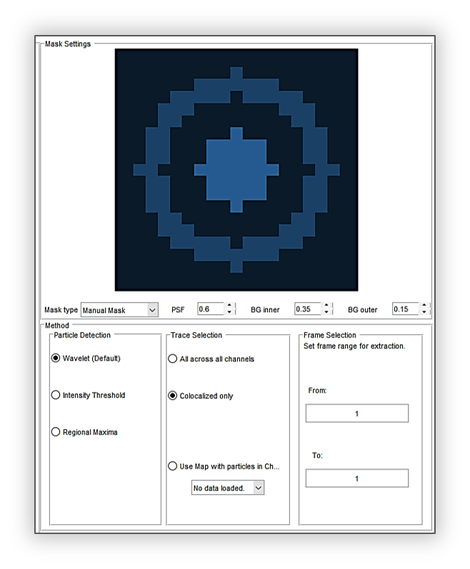
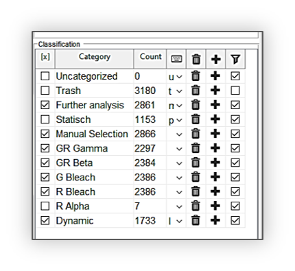
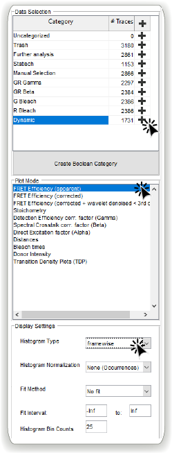
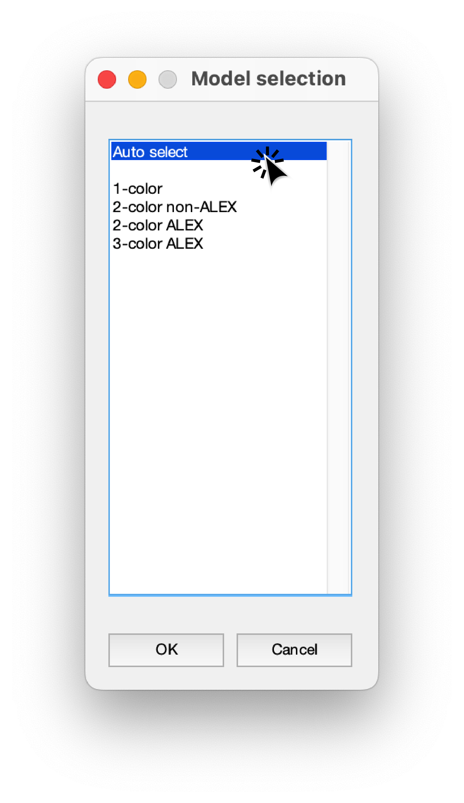
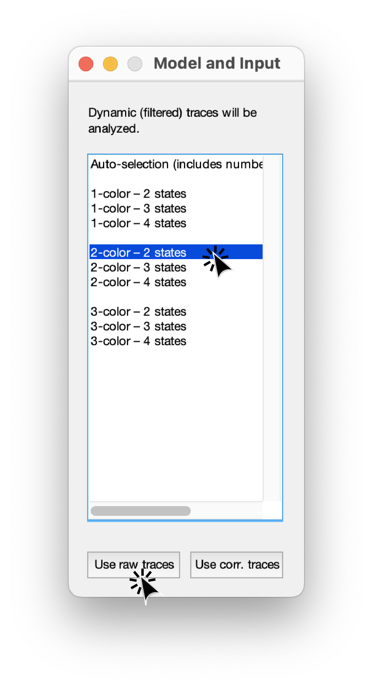
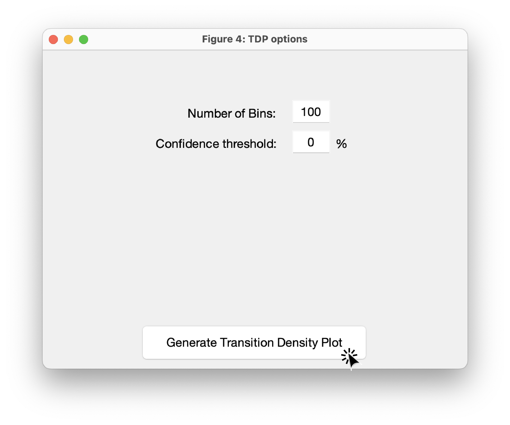
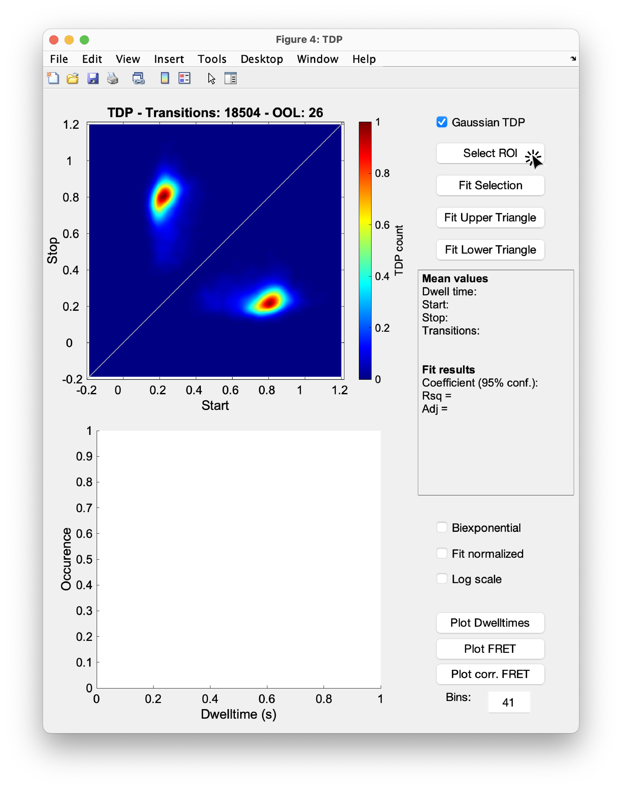

.. |br| raw:: html

    

.. _dynamic-2c:

Dynamic 2c FRET Data
=====

The following example describes how to use *Deep-LASI* to analyze dynamic 2-color smFRET (single-molecule Förster Resonance Energy Transfer) data measured with alternating laser excitation (ALEX). *Deep-LASI* provides you with the options of analyzing your data either manually or automatically using the deep learning neural network. The analysis starts with detecting the co-localized FRET pairs within the field of view from both cameras and extracting their intensity traces, followed by sorting the traces into helpful categories, and determining the correction factors. Afterwards, the underlying kinetics and involved FRET states are analysed, followed by summary of the analyzed data by various plots and histograms.

The following part shows all the steps to analyze dynamic 2C smFRET data from L-shaped DNA origami structures with two FRET states. The example data together with further data sets are accessible from `Wanninger et al., BioArxiv (2023) <https://doi.org/10.1101/2023.01.31.526220>`_.

Overview - Example
------------------
- :ref:`example-data_2c_d`
- :ref:`data-prep_2c_d`
- :ref:`localization_2c_d`
- :ref:`loading-data_2c_d`
- :ref:`extraction_2c_d`
- :ref:`manual_2c_d`
- :ref:`automatic_2c_d`
- :ref:`summary_2c_d`

--------------------------------------------------------------------

Example
-----------

..  _example-data_2c_d:
Sample Design: Dynamic L-Shaped DNA Origami
~~~~~~~~~~~~~~~~~~~~~~~~~~~~~~~~~~~~~~

The described data set originates from smTIRF measurements of 2-state DNA origami structures as you can see in :numref:`dyn-2c-origami-3state`. The origami is labeled with Cy3B (donor) and Atto647N (acceptor). The donor is attached to the flexible tether, which can bind to single-stranded binding sites with a 8 nt, 1 mismatch overhang. The energy transfer is expected between a high FRET State 1 (12 o'clock) and a low FRET State 2 (6 o'clock).

.. figure:: ./../../figures/examples/PA1-Dynamic_2c_Origami.png
   :width: 400
   :alt: 2c-origami-3state
   :align: center
   :name: dyn-2c-origami-3state
   
   L-shaped DNA origami structure labeled with Atto647N and Cy3B. The donor is attached to a tether that can freely bind to the two binding strands.

.. _data-prep_2c_d:
Data preparation 
~~~~~~~~~~~~~~~~~~~~~~~~~~~~~~~~~~~~~~

The origami structures were measured on a smTIRF microscope with two separate EMCCD cameras, one for the donor and one for the acceptor. ALEX with a GR excitation cycle was used to excite the donor and acceptor fluorophores alternatively at an exposure time of 50 ms, also the frame transfer time of the cameras was set to 2.2 ms. The resulting data would then be videos of consecutive frames from each channel with *.tif* file format. You can find a couple of raw data movies on `Zenodo <https://zenodo.org/record/1249497#.Y_D1bnaZPmk>`_.

.. _localization_2c_d:
Co-Localization of Molecules 
~~~~~~~~~~~~~~~~~~~~~~~~~~~~~~~~~~~~~~

When using two separate detection paths like the present example, there might be the chance of some discrepancy between the cameras' fields of view resulting from chromatic and spherical aberrations or cameras misalignment regarding to shifts, rotation, or magnification difference. To make sure that double-labeled species are detected, a correct linking of same molecule emitters across the detection channels is needed. *Deep-LASI* makes a coordinate transformation map to get rid of any potential difference. For more details about mapping, please refer to the section :ref:`mapping`.

To perform the mapping step, we used a zero-mode waveguide (ZMW) as a calibration pattern which was illuminated by the wide-field lamp on the microscope. The ZMW was then imaged on both channels. Through the steps :code:`File > Mapping > Create New Map > 1st channel`, we loaded the zmw image saved from the first channel which in our case is the *.tif* file from the donor or green camera.

On the *Channel Position* pop-up window, you can see a preview of the loaded ZMW image. Here we clicked on *Full* to load the whole camera field of view. No rotation or flipping of the image was needed, so we clicked on *OK* as you can see on :numref:`first map preview`.

.. figure:: ./../../figures/examples/PA2_map_image_loading.png
   :width: 400
   :alt: map image preview
   :align: center
   :name: first map preview

   Pop-up window for adjusting the first mapping image

*Deep-LASI* shows the loaded image on the *Mapping* tab under the part *Channel1*. As described in :ref:`mapping` section, you can change the detection threshold using the bar right under the image. By taking more spots into account, the mapping process would be performed more efficiently.

To load the corresponding image from the second camera (the acceptor channel), we took the same steps from the file menu, this time for the second channel via :code:`File > Mapping > Create New Map > 2nd channel`. 

After choosing the image file, the same *Channel Position* window will open. To have the maximum overlay to the ZMW image from the first channel, we took the whole field of view by clicking on *Full* and no rotation again. The only obvious difference was that the current image was flipped horizontally compared to the first one. After checking the *Horizontal Flip* box, we clicked on *OK*.    

Now you can see both images on the corresponding panels, and they look having the same pattern at least by eye (:numref:`start 2C mapping`). It means that the criteria chosen for loading the mapping images were correct. On the *Mapping Controls* panel, we did not change the reference channel, so by default it assumes the first (donor) channel to be the reference, and will map the second channel based on the first one. Then, we clicked on *Start Mapping*. 

.. figure:: ./../../figures/examples/PA6_start_mapping.png
   :width: 500
   :alt: start mapping
   :align: center
   :name: start 2C mapping

   Starting the mapping step after having both ZMW images loaded

Mapping takes usually a couple seconds. Afterwards, *Deep-LASI* opens a *Map Result* window showing the channels overlay before and after mapping. It is recommended to check the overlay quality at this point. The result is fine most of the times, but if the mapping result was not satisfactory, we would capture new images from the ZMW on both cameras, and repeat the mapping step.

After mapping is successfully finished, we go to mapping menu to save the map file in the data folder through :code:`File > Mapping > Save Map`. At a later time, if the map is needed, we can simply go to mapping menu and click on :code:`File > Mapping > Load Prev. Map` to open a previously saved one, or use the shortcut *Ctrl+M*. 
   
..  _loading-data_2c_d:
Loading the Data
~~~~~~~~~~~~~~~~~~~~~~~~~~~~~~~~~~~~~~

After finishing the mapping process, we continued with opening the data files on the program. From the file menu we loaded the data of the first channel (the green, as specified during the mapping process) via :code:`File > Load Image Data > 1st channel` and selected all the files.

On the opened window to select the data files, we selected all the image files from the green channel which were in total 70 Tiff files meaning that the smTIRF measurement was carried out on 70 areas of the sample surface. Then the *Measurement Parameters* pop-up window appeared to take in the details of the experiment. As you can see on :numref:`measurement_parameters`, for *Interframe time*, we typed in 52.2 which is the sum of laser exposure time (50 ms) and frame transfer (2.2 ms). The illumination used for the measurement was the alternation of yellow and red lasers, so for the *ALEX sequence* we entered GR. Then we clicked on the empty line right after the ALEX box, the slider will show up and we put the slider on the left to determine the first channel. We had captured 1000 frames on each camera, having two of them, every data file contains 2000 frames in total, and because our first frame is always a dark one, we loaded the frames from the second one until the end. So, we entered *2 to 2000* for the both frame range rows (loading & particle detection). Then we clicked on G to specify the donor channel (:numref:`measurement_parameters`, left).   

.. figure:: ./../../figures/examples/PA10_measurement_parameters.png
   :width: 700
   :alt: measurement_parameters
   :align: center
   :name: measurement_parameters
   
   Setting the measurement parameters to load the data from the green channel

Then the particle detection panel appears on the *Extraction* tab showing the detected molecules inside green triangles, and the number of them in a black box on the top right panel.

Then we took the same steps to open the data images from the second camera via :code:`File > Load Image Data > 2nd channel`. The 70 data files from the second channel corresponding to the ones from the first one were selected.

On the *Measurement Parameters* pop-up window (:numref:`measurement_parameters`, right), we set the slider to the right indicating the acceptor channel, and without changing anything else, clicked on *R*. 

The red emitters from the first data file appear on the same particle detection panel that we had for green molecules. You can use the sliders again to adjust the display contrast and the detection threshold this time for the second channel. The detected molecules are trapped inside the red triangles, and the number of them together with the number of co-localized molecules are shown in the black box. The lowest slider is also now active to choose either of the channels as the current channel view (:numref:`colocalized GR particles`).  

.. figure:: ./../../figures/examples/PA14_colocal_detection.png
   :width: 400
   :alt: colocal particles
   :align: center
   :name: colocalized GR particles
   
   Particles detected from the first data file recorded by both channels and the co-localizations
   
..  _extraction_2c_d:
Trace Extraction
~~~~~~~~~~~~~~~~~~~~~~~~~~~~~~~~~~~~~~

With the data files being loaded to the program, one can extract traces as the next step. For more details about trace extraction, please refer to the section :ref:`extraction_doc`. On the *Mask Settings* panel we did not change anything (:numref:`extraction begin`). For the *Method* part, we used *wavelet* for the *Particle Detection*, *Colocalized only* for the *Trace Selection*, and also left the frame range to be 2 to 2000 for the *Frame Selection*. Then we clicked on *Extract Traces*.

   
   The box for adjusting options for the detection mask, and settings for trace extraction

Depending on the data size, the extraction step might take some time from a couple of minutes to hours. When it is done, a final data file with the format *.tdat* will be saved in the data folder by the program, and the first trace appears on the *Traces* tab. As you can see on :numref:`2c trace look`, the intensity-time panel shows the following four intensity traces: The total intensity in the green channel in gray, the donor emission after donor excitation in green, the acceptor emission after donor excitation in bright red, and the acceptor emission after acceptor excitation in dark red. On the middle panel you can see the mask surrounding every detected molecule across every channel. On the right you can see a total number of 6100 traces were extracted from the loaded data. Everything is now ready for us to start the analysis steps with categorizing the traces first.     

.. figure:: ./../../figures/examples/PA16_trace_look.png
   :width: 550
   :alt: 2c trace
   :align: center
   :name: 2c trace look
   
   Exemplary trace for a two-color smTIRF measurement, and all different panels on the *Traces* tab
   
..  _manual_2c_d:

Manual data analysis and correction
~~~~~~~~~~~~~~~~~~~~~~~~~~~~~~~~~~~~~~

For a detailed description of manual analysis steps please see the section :ref:`manual_analysis`. By using the *Navigation* slider we clicked through the traces one by one to check their individual features and attribute them to one or several categories created in the *Classification* chart. 

The first step for the categorization is to make sure if we are taking the single molecule traces into account. We usually get a first hint by just looking at the masks. A single molecule being detected in the middle of the mask like the one on :numref:`mask checking` on the left is what we consider as a single molecule, and keep the corresponding trace in categories helpful for further analysis. But if you check the example on the right side of the figure, you see there are more than one molecule in the middle, also molecules sitting on the background ring will mess up with the background calculation. Either of these is enough for us to trash the trace extracted from this spot.  

.. figure:: ./../../figures/examples/PA18_mask_checking.png
   :width: 400
   :alt: mask check
   :align: center
   :name: mask checking
   
   *Deep-LASI* makes a mask around each emitter for intensity trace extraction and background calculation. An example of a single detected molecule is shown on the left. A molecule distribution like the case on the right, makes the whole trace worthless.

After ensuring that a single molecule is inside the mask and there is no interference for the background calculation, we checked the traces. A nice indicator of a single molecule trace in our experiment is to see one single bleaching step, if this is met, we continue with selecting the regions where the fluorophores are active. For region selection, we click anywhere on a trace to have the mouse as an active cursor, then we pressed the key *1* on the keyboard to have the cursor active for the first (green) channel. Then as you can see on :numref:`green-red region selection` on the left, we dragged the mouse from the beginning to the end of the trace, because the Cy3B is active throughout the whole trace. You can also see the selected region shadowed in green. Then we pressed the key *2* twice to release the cursor from the first channel and activate it for the second channel, and as you can see on the right side of :numref:`green-red region selection`, we selected the red region from the trace beginning until the bleaching step of Atto 647N.      

.. figure:: ./../../figures/examples/PA19_dye_active_region.png
   :width: 600
   :alt: region
   :align: center
   :name: green-red region selection
   
   Selecting the trace regions where the donor or acceptor dye is active, shown on the left and right side of the figure respectively.

You can see on :numref:`correction factors calculation` how the trace will look if we have both green and red regions selected. Also the FRET efficiency trace gets the selected region until the first bleaching step. A faster way of region selection that we usually do is to only activate the mouse and without pressing *1* or *2*, select the region of traces that both dyes are active. In other words, with the general cursor we start dragging the mouse from the desired beginning time until the first bleaching step. After the region selection, *Deep-LASI* determines all correction factors possible to calculate, and updates the values in the box named *FRET controls* as you can see in the bottom right of the figure. In this example because the acceptor got bleached first, the program calculated the gamma and crosstalk correction factors. In the *Classification* box, you can see that we put the example trace in the categories of *Manual Selection*, *GR Beta*, *GR Gamma*, *G Bleach*, and *R Bleach*. We also have the option of having the program select the region by only pressing the *E* key.

.. figure:: ./../../figures/examples/PA20_correction_factor_box.png
   :width: 550
   :alt: correction factors
   :align: center
   :name: correction factors calculation
   
   Selected region on the intensity and FRET efficiency traces, categorization, and correctin factors determination

We clicked through all the 6100 traces the same way described above, and finished the categorization. We ended up with categories shown on :numref:`manually categorized`. 

   
   Categories manually created for the two-color two-state DNA origami sample
   
After categorization, we went to the *Histograms* tab to plot the results. As you can see on :numref:`apparent FRET plotting criteria`, we first chose the *Dynamic* category by clicking on the plus sign beside it, then for the *Plot Mode* we chose the *FRET Efficiency (apparent)* to be the x axis, and on the *Display Settings* we chose the histogram type to be *framewise*.

   
   The settings to plot the apparent FRET efficiency of the dynamic category

With the mentioned settings the histogram of apparent FRET efficiency appears like the left panel of :numref:`apparent FRET`. You can see the two FRET populations as we expected for the dynamic DNA origami sample. Then for fitting the result, we set the *Fit Method* to *Gauss2*, and then clicked on *Fit Plot*. The fitting result is shown on the right side of :numref:`apparent FRET`. You get all the fitting values as a box attached to the histogram. 

.. figure:: ./../../figures/examples/PA22_app_FRET.png
   :width: 600
   :alt: app FRET
   :align: center
   :name: apparent FRET
   
   Apparent FRET efficiency histogram with the fitting result

To get the corrected FRET efficiencies, we plotted each correction factor by choosing the desired one from the list of parameters in *Plot Mode* as shown previously on :numref:`apparent FRET plotting criteria` in the middle part. For the direct excitation factor, we clicked on *Direct Excitation factor (Alpha)*, and selected the category **G Bleach** since we need the donor bleaching step for this calculation. The resulting plot with its fitting is shown on :numref:`all correction factors` on the left. For fitting we chose *Gauss1* from the *Fit Method* section, the value of 0.124 was reported after the fitting. Also from *Histogram Normalization*, the option *Unary* was selected to normalize the plot. To plot the other two correction factors we selected the category **R Bleach** because the acceptor bleaching step is needed for them to be determined. Then in *Plot Mode* we clicked on *Spectral Crosstalk corr factor (Beta)*. With the same steps for plot fitting and normalization, the middle panel of :numref:`all correction factors` and final value of 0.12 was obtained. Then we clicked on *Detection Efficiency corr factor (Gamma)* to get its distribution histogram. Taking steps similar to the previous case, the plot was fitted and normalized with the final value of 0.75 for the gamma factor, like :numref:`all correction factors` on the right.      

.. figure:: ./../../figures/examples/PA23_correction_factors_fit.png
   :width: 650
   :alt: factors
   :align: center
   :name: all correction factors
   
   Correction factors plotted and fitted. From left to right, direct excitation, spectral crosstalk, and detection efficiency correction factors.

To plot the corrected FRET efficiency, we selected the category *Dynamic* again, clicked on the *FRET Efficiency (corrected)*, fitted the plot with *Gauss2* fitting method, and normalized it. You can see the resulting plot on :numref:`corrected FRET hist` with the two final values of 0.141 and 0.810 for the two FRET efficiencies. 

.. figure:: ./../../figures/examples/PA24_corr_FRET.png
   :width: 400
   :alt: corr FRET
   :align: center
   :name: corrected FRET hist
   
   Corrected FRET efficiency histogram with the fitting result

To get dynamic information about the sample, we went to *HMM* tab, selected the dynamic category (:numref:`corrected FRET hist`), and clicked on *Start HMM*.

.. figure:: ./../../figures/examples/PA25_HMM_run.png
   :width: 500
   :alt: HMM satrt
   :align: center
   :name: HMM starting
   
   Steps for running HMM on dynamic data 

After a short while, the left plot of :numref:`HMM resulting graphs` appears inside the panel *Transition Density Plot*. Then we clicked on the button *Select ROI* to encircle the desired region of interest. You can draw any circle around a cluster on the plot by dragging the mouse around it as we did on the lower cluster showing transitions from high to low FRET efficiencies. On the most right panel the dwell time graph with its fit will appear giving all the fitting values. The dwell time based on the transitions cluster we selected are then 3.1 s. 

.. figure:: ./../../figures/examples/PA26_TDP_dwell_time.png
   :width: 600
   :alt: HMM results
   :align: center
   :name: HMM resulting graphs
   
   TDP plot with analysis options and dwell time fitting

If you have been following the manual analysis steps, you might know now how much time it can take to analyze the data from one day of measurement. If such amount of time feels too much, *Deep-LASI* offers you automatic data analysis as follows.

..  _automatic_2c_d:
Automatic data analysis and correction
~~~~~~~~~~~~~~~~~~~~~~~~~~~~~~~~~~~~~~

In the following section you will be guided through the automated analysis steps for dynamic 2-color smFRET data. This is an additional program using pre-trained deep neural networks which makes your analysis time way shorter and more joyful!

To perform automated analysis, we need to load already extracted traces. Meaning that the steps described in the manual analysis section from mapping to trace extraction would be all the same. On :numref:`mainGUI` you can see the traces that were extracted and manually analyzed in the above sections. Here all the 6100 traces are in the *Uncategorized* category meaning that no analysis was performed on them. To start the automatic analysis, we first clicked on the button *Deep Learning*.   

.. figure:: ./../../figures/examples/1_MainGUI_click.png
   :width: 550
   :alt: mainGUI
   :align: center
   :name: mainGUI
   
   The main GUI of *Deep-LASI* on the *Traces* tab showing the loaded data traces

On the opened panel as shown on :numref:`DeepLearning_tab` you can see the *Magic Button* in bright pink color. Now you can just click on it to enjoy the resulting graphs appearing one after another. So, all the results shown in the following parts would open at once in separate windows. But, because one could also achieve the same results with a several automatic analysis steps, depending on the analysis needs we can decide which analysis step the *Deep-LASI* should perform for us. For example, sometimes we need the *Deep-LASI* to only categorize the data, or just make the TDP plot for the dynamics of a specific category.

.. figure:: ./../../figures/examples/2_DeepLearningTab.png
   :width: 550
   :alt: DeepLearning_tab
   :align: center
   :name: DeepLearning_tab
   
   The *Magic button* under the *Deep Learning* tab

In the present described example, we performed the automatic analysis steps once at a time to show you the user analysis freedom beside the *Magic Button* power.

We first clicked on *Categorize Traces*, then a window like the one on :numref:`ModelSelection_for_categorization` opens to take in the neural network model from the user. If one of the options provided fits to your measurement, you can select that particular one, otherwise you can select the first option called *Auto select* as we did, and click on *OK*. 

   
   Model selection window to specify the fitting neural network to the data type

After a short while the traces get categorized as shown on :numref:`categorized_traces`, and if you click through the traces, you can see the regions on each trace being selected by the program. The user can always go through the traces after automatically been analyzed to make desired changes, and save the changes on the data file. With automatic categorization, the bleaching steps and consequently the correction factors would also be defined in the program.  

.. figure:: ./../../figures/examples/4_CategorizedTraces.png
   :width: 600
   :alt: after_categorization
   :align: center
   :name: categorized_traces
   
   The example data traces categorized automatically

To continue the analysis regarding to the kinetics of the sample, a next window like the one on :numref:`StateTransition_ModelSelection` opens to take in the neural network from the user. We selected the *2-color-2 states* that matches with our DNA origami sample system and clicked on *Use raw traces*.

   
   Model selection window to specify the fitting neural network to the dynamic transitions
   
..  _summary_2c_d:
Plotting and Summary of Results
~~~~~~~~~~~~~~~~~~~~~~~~~~~~~~~~~~~~~~

In this section, the resulting graphs after the automatic analysis are listed and presented.

After analysis gets finished, *Deep-LASI* reports its confidence level for predicting existing states on each trace. As you can see the histogram from our data on :numref:`tracewise_state_confidence_histogram`, such confidence level of the neural network is quit high and close to 1. The statistics shown on the y axis is also quit convenient.

.. figure:: ./../../figures/examples/6_StateConfidence_Histogram.png
   :width: 350
   :alt: state-confidence-histogram
   :align: center
   :name: tracewise_state_confidence_histogram
   
   The *Deep-LASI* confidence level for determining the states on each trace

Another resulting histogram is the apparent FRET efficiency to give a quick overview of the existing FRET populations. It is the mean FRET efficiency observed on the states found along the traces(:numref:`statewise-meanFRET_histogram`). 

.. figure:: ./../../figures/examples/7_Statewise_MeanFRET.png
   :width: 350
   :alt: statewise-meanFRET
   :align: center
   :name: statewise-meanFRET_histogram
   
   The histogram of apparent FRET efficiency averaged for each state

Before the program generates the TDP plot, a window like :numref:`TDP_input` pops up to take in the desired number of bins and confidence threshold from the user. We set the number of bins to 100 and the threshold on 0, then clicked on *Generate Transition Density Plot*.

   
   The GUI asking for TDP options

Then the TDP is generated like :numref:`TDP_generated`. To select the upper cluster, we first clicked on *Select ROI*, and dragged the mouse around the cluster. 

   
   The generated TDP opened in a window with various fitting and plotting options 

Right after selecting the cluster, the resulting values including the dwell time, initial and final FRET efficiencies, number of transitions, and all fitting details appear inside the box on the right side of the window as you can see on :numref:`TDP_selection_and_livefit`. If you change your selection, all the presented results would be updated immediately.

.. figure:: ./../../figures/examples/10_TDP_PopulationSelection_and_LiveFit.png
   :width: 400
   :alt: TDP_selection_and_fit
   :align: center
   :name: TDP_selection_and_livefit
   
   Selecting TDP clusters to achieve live fitting results

Finally, all correction factors are plotted as histograms with their mean, median, and mode values reported on them. As you can see on :numref:`correction_factors_DE_and_CT`, the moleculewise direct excitation and spectral crosstalk are shown on the left and right side of the window respectively. The statistical information about them are also presented.

.. figure:: ./../../figures/examples/11_DataCorrection_DirEx_Crosstalk.png
   :width: 500
   :alt: de_and_ct
   :align: center
   :name: correction_factors_DE_and_CT
   
   The histograms of direct excitation and spectral crosstalk correction factors reported with statistics

Also the detection efficiency correction factor (gamma factor) calculated based on the mean, median, and mode values of direct excitation and spectral crosstalk factors is calculated and reported on a separate window like :numref:`correction_factor_gamma_factor`. Comparing the resulting factors with what we obtained from manual analysis shows that the median values of correction factors are usually a better estimation for our data set.

.. figure:: ./../../figures/examples/12_DataCorrection_Gamma.png
   :width: 500
   :alt: gamma_factor
   :align: center
   :name: correction_factor_gamma_factor
   
   The histograms of detection efficiency correction factor reported with statistics
   
