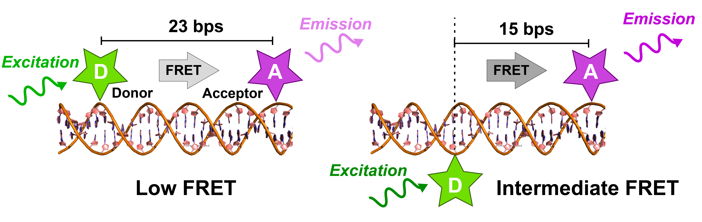
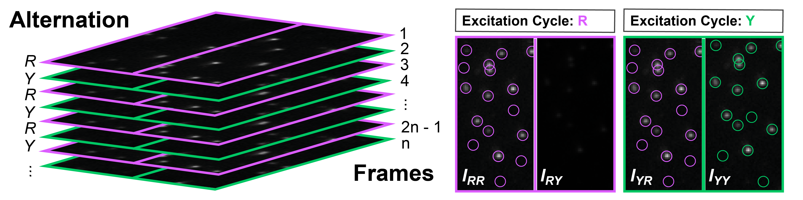
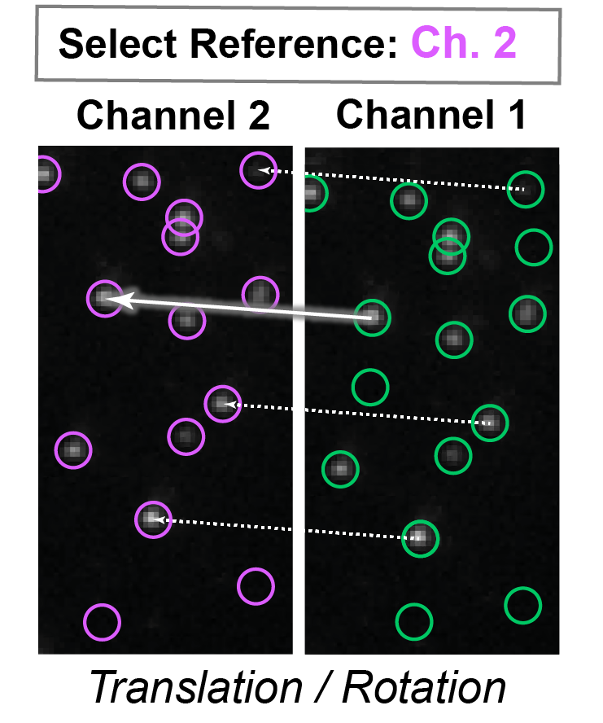
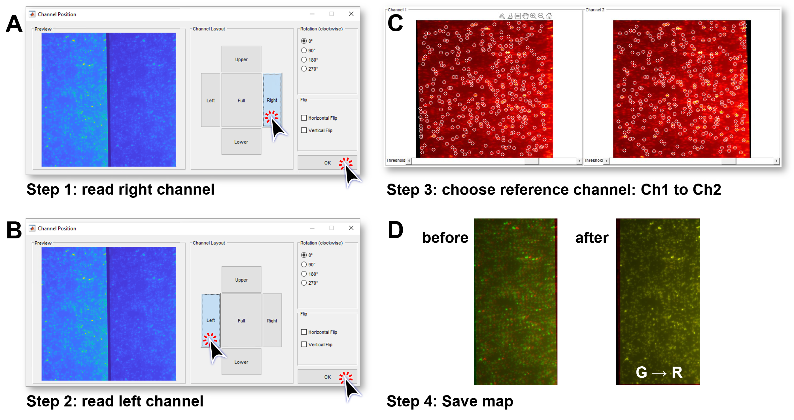
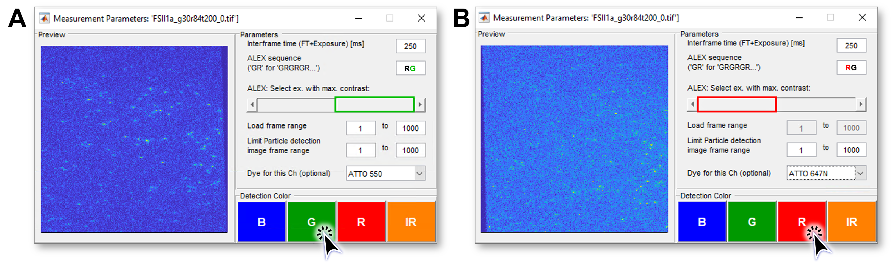

.. |br| raw:: html

    

.. _static_2c:

Static 2c FRET Data
=====

The following section describes the workflow when analyzing static, 2-color smFRET (single-molecule Förster Resonance Energy Transfer) data.
Deep-LASI provides a modular workflow for analyzing the data, either manually or automatically. The analysis starts with the co-localization of fluorescent molecules between both channels and trace extraction, the categorization process, the determination of correction factors, the selection of time windows to be analyzed per single time trace, the kinetic analysis, and ends with a summary of the analyzed traces by calculating the distribution of the correction factors, the FRET and stoichiometry values.

We describe how to use *Deep-LASI* for two examples: (1) a publicly available example data set published by `Hellekamp et al., Nat. Meth (2018) <https://www.nature.com/articles/s41592-018-0085-0>`_, which was recorded on a split camera, and (2) a static two-color DNA origami sample, which was recorded on two separate cameras.
Further sample data sets can be found, e.g., in `Wanninger et al., BioArxiv (2023) <https://doi.org/10.1101/2023.01.31.526220>`_.

.. We discuss two examples for publicly available sample data from `Hellekamp et al., Nat. Meth (2018) <https://www.nature.com/articles/s41592-018-0085-0>`_ and `Götz et al., Nat. Meth (2022) <https://www.nature.com/articles/s41467-022-33023-3>`_.

Overview - Example 1
------------------
- :ref:`example-data1`
- :ref:`data-prep1`
- :ref:`localization1`
- :ref:`extraction1`
- :ref:`manual1`
- :ref:`automatic1`
- :ref:`summary1`

--------------------------------------------------------------------

Example 1
-----------

..  _example-data1:
Sample Design: Static Double-Stranded DNA
~~~~~~~~~~~~~~~~~~~~~~~~~~~~~~~~~~~~~~
The first data sets are chosen from a multi-laboratory `benchmark study <https://www.nature.com/articles/s41592-018-0085-0>`_. It contains two single-molecule data sets of double-labeled DNA molecules. The two samples feature a low (:numref:`fig_DNA`, left) and intermediate FRET efficiency (:numref:`fig_DNA`, right) by design, with the attached fluorophore pairs being separated by 23 and 15 base pairs, respectively.

   
   Double-Stranded DNA labeled with the donor dye Atto550 and acceptor dye Atto647N in 23 bp distance (left) and 15 bp separation (right).

.. _data-prep1:
Data preparation 
~~~~~~~~~~~~~~~~~~~~~~~~~~~~~~~~~~~~~~
The DNA molecules were recorded on a TIRF microscope with dual-view inset and alternating laser excitation at an exposure time of 250 ms (:numref:`dualview`). To analyze the data, we downloaded the raw data from `Zenodo <https://zenodo.org/record/1249497#.Y_D1bnaZPmk>`_ and saved the raw *.tif* files for (1) the calibration measurement, (2) the low FRET sample and (2) the intermediate FRET sample.

.. tip:: @Pooyeh and Simon, can you please check the exposure and frame time. (ALEX sampling rate 2.5 Hz)

   Alternation cycle and position of the two detection channels on the camera when using a dualview inset.

In the first step, we need to identify the detection channels, i.e., their position on the camera and the applied laser excitation schemes (:numref:`dualview`). For this, we can, for example, use ImageJ to load any of the downloaded movies encoding the single-molecule data of the two DNA constructs.
When looking at the tiff-stack with alternating laser excitation on a frame-to-frame basis, we can identify the detection channels best during the red excitation period: frames with red excitation show emission on the left half of the camera (acceptor emission after acceptor excitation), while no emission signal is observed on the right half of the camera (Donor emission after acceptor excitation) due to the mission excitation of the donor molecule. This means the donor emission after donor excitation (DD) is detected on the right half of the camera, while the acceptor emission after donor excitation (DA) or direction excitation (AA) is recorded on the left half of the camera. Furthermore, we can identify an ALEX cycle RG starting with red excitation R followed by yellow excitation Y for 1 frame each (:numref:`dualview`).

.. _localization1:
Co-Localization of Molecules
~~~~~~~~~~~~~~~~~~~~~~~~~~~~~~~~~~~~~~
Next, we need to know where double-labeled DNA molecules are detected on the two field-of-views (FOV) of the camera, i.e., which pixel on the red channel corresponds to a pixel on the yellow detection channel (:numref:`fig_mapping`). While differences in magnification will not be observed on a single camera, there can be still a slight tilt or shift between the two images due to the alignment of dual-view inset.

   Determination of the transformation matrix by mapping the donor on the acceptor channel.

To retrieve the transformation matrix, which translates single molecule localizations in one channel onto the other, we first used *Deep-LASI* to generate a map. For this, we loaded the calibration file *calib20140402_0.tif* into the software. In the first step (:numref:`calib`, A), we read in the data from the **yellow** channel (which is on the right half of the movie) into the first channel. For this, we loaded the movie via :code:`File > Mapping > Create New Map > 1st channel`. *Deep-LASI* can handle input data with full or halved field-of-view. We chose the right half of the camera for the yellow data and confirmed. In the second step (:numref:`calib`, B), we load the data for the **red** channel via :code:`File > Mapping > Create New Map > 2nd channel` and choose the left half of the camera.

   Workflow to create a map between both detection channels.

After loading the data, *Deep-LASI* shows the averaged image for each detection channel separately and automatically detects single emitters (:numref:`calib`, C). The numbers of localization and potential mislocalization can be adopted using the slider below the two images. We chose Channel 2 (red camera) as a reference, i.e., *Deep-LASI* warps the image from the *yellow* channel onto the *red* detection channel.
The result is afterwards shown in a side-by-side image that depicts the overlay of both channels before and after the mapping (:numref:`calib`, D). Lastly, we saved the generated map via :code:`File > Mapping > Save Map`.

.. _extraction1:
Trace Extraction
~~~~~~~~~~~~~~~~~~~~~~~~~~~~~~~~~~~~~~
After generating the transformation matrix via mapping or reloading the already generated map via :code:`File > Mapping > Load Prev. Map (Ctrl + M)`, we can load the actual single-molecule data in the next step. To obtain the trajectories of individual molecules depending on the laser excitation, *Deep-LASI* can detect and extract traces on a single file basis. For this, it can read single *.tif* files and save the extracted traces in separate *.mat* files, which can be added file-by-file afterwards for further analysis. However, *Deep-LASI* also permits extracting traces from raw data files with consecutive numbering. In the presented example, we proceeded by reading in all raw *.tif* files per experiment at once, i.e., the data files *FSII1a_g30r84t200_0.tif* until *..._6.tif* or *FSII1b_g30r84t200_0.tif* until *..._6.tif* for the 'low-FRET' and 'intermediate-FRET' sample, respectively. We loaded the data of the first channel (as specified during the mapping process) via :code:`File > Load Image Data > 1st channel` for the yellow channel and selected the files.

   Settings for extracting the different emission channels depending on the excitation cycle.

Next, we specified the experimental settings for *Deep-LASI* (:numref:`extraction`, A). We provided the interframe time of 250 ms, given by the exposure time and frame time, which are 250 ms and xxx ms, together. Next, we specified the excitation cycle 'RG' by typing in the ALEX sequence.

.. note:: Due to coding reasons, *Deep-LASI* recognizes the letters B, G, R, and IR as input for the laser excitation in the ALEX cycle. They are required for the correct selection of laser excitation cycle and visualization in multi-color experiments, later. Yellow excitation is referred to as 'green' (G) excitation.

The ALEX sequence activates a slider that allows one to switch between the specified number of excitation sources and to observe in the image on the left whether the correct slider position is set. We chose the yellow excitation cycle by selecting the right position of the slider. *Load frame range* and *Particle detection range* allow for omitting frames (at the beginning or the end) in case of measurement errors or other experimental settings. For reading in ALEX data in this example, we can read in all frames - ranging from 1 to the total number of frames, which is 1000 in the case of the 'low-FRET' sample and 1600 in the case of the 'high-FRET' sample. Selecting the fluorophore in this study is optional and will provide additional metadata to the saved file containing the extracted traces. We finished the read-in process by selecting the yellow detection channel by pressing the green button (:numref:`extraction`, A).

.. note:: While in 4-color FRET experiments, the channel order from 1 to 4 directly matches the detection channels, in 3-color or 2-color FRET experiments, in particular, there are different combinations of excitation and detection channels (BG, GR, RIR, BR, BIR, GIR) that will lead to an identical extraction of the single-molecule data as long as the corresponding ALEX sequence is given and matching the detection channels. The only difference is that *Deep-LASI* will choose different colors when displaying the traces afterwards. *Deep-LASI* will interpret the detection channels in the order of channels presented during the mapping process. For consistency, we chose yellow/red excitation.

In the second step, we loaded the data of the red detection channel via :code:`File > Load Image Data > 2nd channel` and selected the files. Next, we provided the experimental settings for the red channel (:numref:`extraction`, B) and specified the interframe time of 250 ms and the excitation cycle 'RG' by typing in the ALEX sequence.
We chose the red excitation cycle by selecting the left position of the slider and confirmed all frames 1-1000 (1-1600 in the case of the 'intermediate-FRET' sample). Having specified the fluorophore, we finish the read-in process by selecting the red detection channel by pressing the red button (:numref:`extraction`, B).

In the following, *Deep-LASI* automatically reads the raw data file-by-file, localizes molecules in the donor channel, identifies molecules in the acceptor channel by mapping, and extracts the trajectories depending on the excitation cycle of every molecule found. This process is carried out iteratively for the number of files specified and can last several minutes. The progress of the extraction process is shown in the left corner of the GUI and allows one to guesstimate the waiting time. Once the extraction process is finished, save the extracted traces via :code:`File > Save Traces / State (Ctrl + S)`

.. note:: In case an error occurs, try to save the extracted traces anyhow. For some Windows installations test sofar, we encounter a GUI error at the end of the extraction process, which has no influence on the prior extraction process.

.. _manual1:
Manual data analysis and correction
~~~~~~~~~~~~~~~~~~~~~~~~~~~~~~~~~~~~~~

.. _automatic1:
Automatic data analysis and correction
~~~~~~~~~~~~~~~~~~~~~~~~~~~~~~~~~~~~~~

.. _summary1:
Plotting and Summary of Results
~~~~~~~~~~~~~~~~~~~~~~~~~~~~~~~~~~~~~~

.. -----------------------------------------------------

.. Overview - Example 2
.. ------------------
.. - :ref:`example-data2`
.. - :ref:`data-prep2`
.. - :ref:`extraction2`
.. - :ref:`automatic2`
.. - :ref:`manual2`
.. - :ref:`summary2`

.. -----------------------------------------------------

.. Example 2
.. -----------

