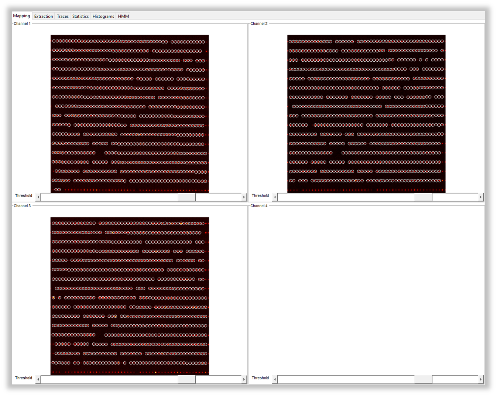
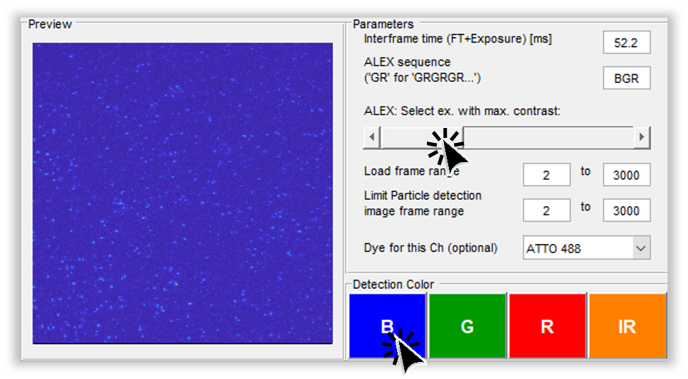
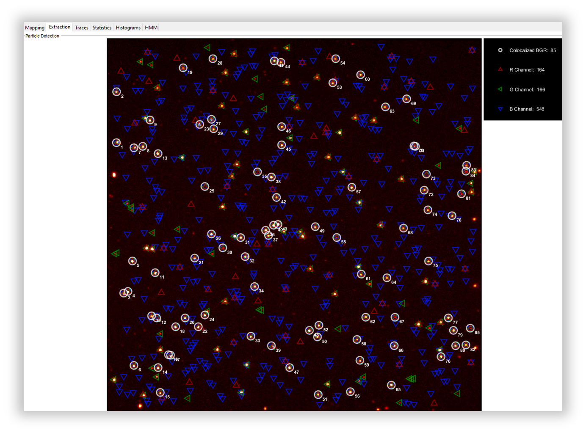
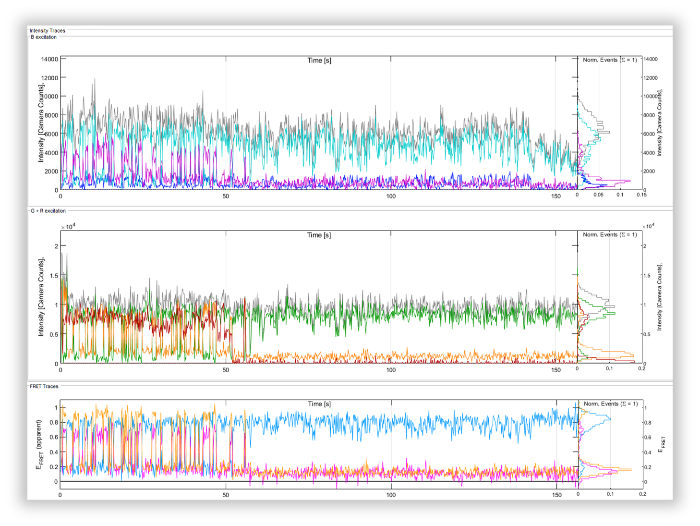
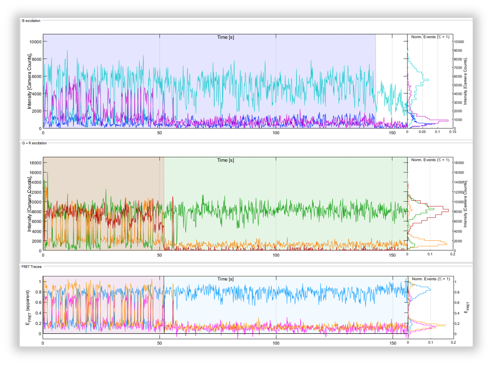

.. |br| raw:: html

    

.. _dynamic-3c:

Dynamic 3c FRET Data
=====

Here you can see how to use DeepLASI to analyze dynamic 3-color smFRET (single-molecule Förster Resonance Energy Transfer) data measured with alternating laser excitation (ALEX). DeepLASI provides you with the options of analyzing your data either manually or automatically using the deep learning neural network. The analysis usually starts with detecting the co-localized FRET pairs within the field of view from all cameras and extracting their intensity traces, followed by sorting the traces into helpful categories, and determining the correction factors. Afterwards, you can continue the analysis steps for the kinetics of the sample system and visualize the whole data on various plots and histograms.

The following part shows all the steps to analyze dynamic 3C smFRET data from L-shaped DNA origami structures with three FRET states. The example data together with further data sets are accessible in `Wanninger et al., BioArxiv (2023) <https://doi.org/10.1101/2023.01.31.526220>`_.

Overview - Example
------------------
- :ref:`example-data_3c`
- :ref:`data-prep_3c`
- :ref:`localization_3c`
- :ref:`loading-data_3c`
- :ref:`extraction_3c`
- :ref:`manual_3c`
- :ref:`automatic_3c`
- :ref:`summary_3c`

--------------------------------------------------------------------

Example
-----------

..  _example-data_3c:
Sample Design: Dynamic L-Shaped DNA Origami
~~~~~~~~~~~~~~~~~~~~~~~~~~~~~~~~~~~~~~

The described data set is from smTIRF measurement with DNA origami structure as you can see on :numref:`FIGURE`. The origami is labeled with Atto 488 (donor), Cy3B (donor/acceptor), and Atto647N (acceptor). The yellow dye (Cy3B) is attached to the flexible tether binding freely among three single-stranded binding sites, with 7 nt overhang on both 6 and 12 o'clock binding positions, and a 8 nt, 1 mismatch overhang on the 9 o'clock position. The energy transfer is expected to be distributed within a high, medium, and low FRET for each dye pair of blue/yellow and yellow/red. However, the FRET between blue/red pair is expected to be static because both dyes are attached directly to the origami.

FIGURE. L-shaped DNA origami structure labeled with Atto 488, Cy3B, and Atto647N. The yellow dye is attached to a tether that can freely bind to any of the three binding strands. 

.. _data-prep_3c:
Data preparation 
~~~~~~~~~~~~~~~~~~~~~~~~~~~~~~~~~~~~~~

The origami structures were measured on a smTIRF microscope with three separate EMCCD cameras, one for each fluorescent dye on the sample. ALEX was used to excite the three fluorophores alternatively at an exposure time of 50 ms, also the frame transfer time of the cameras was set to 2.2 ms. The resulting data would then be videos of consecutive frames from each channel with .tif file format. You can find a couple of example raw data on Zenodo.

.. _localization_3c:
Co-Localization of Molecules 
~~~~~~~~~~~~~~~~~~~~~~~~~~~~~~~~~~~~~~

When using three separate cameras like the example described here, there might be the chance of some discrepancy among the cameras’ fields of view resulting from aberrations or cameras misalignment. To make sure that tripple-labeled species are detected, a correct linking of same molecule emitters across the detection channels is needed. DeepLASI makes a coordinate transformation map to get rid of any potential difference.

Mapping the three channels are quit similar to the two-channel situation. In order to map all cameras, please follow the steps explained in the section **Co-Localization of Molecules, 2c-FRET-Dynamic, linking** , because the necessary workflow for loading the ZMW images are the same untill :numref:`map image flipping`. The difference would be that you do not need to flip the image from the second camera (as you would clearly recognize by looking at it), and you need to continue loading the ZMW image also from the third channel (now with horizontal flipping). If you have loaded the mapping images correctly, you will see the three panels similar to :numref:`three zmw loaded`. Then you can click on *Start Mapping* like we did. Please also follow the final steps in **Co-Localization of Molecules, 2c-FRET-Dynamic, linking** to check the mapping quality and save the created map.     

   
   The loaded ZMW images from all three cameras in the mapping tab 

..  _loading-data_3c:
Loading the Data
~~~~~~~~~~~~~~~~~~~~~~~~~~~~~~~~~~~~~~

After having the cameras mapped with respect to the first channel, we continued with loading the data files. Like mapping step, loading the raw data from three cameras is similar to that from two cameras with some little difference that are explained here. To see how to load the data please first check the section **Loading the Data, 2c-FRET-Dynamic, linking**. After selecting all the data files, on the first *Measurement Parameters* window opened, we first filled in the boxes like :numref:`3c_measurement_parameters1` to match the experimental details. The *Interframe time* is still 52.2 ms. The ALEX sequence is BGR in the current example because the three lasers were alternating one after another. Then we set the slider to the very left side to determine the first detection channel. After selecting the desired frame range, we clicked on **B** for the detection color.

   
   Setting the measurement parameters to load the data from the first (blue) channel  

Now on the *Extraction* tab the detected particles will be marked inside blue triangles. We continued with loading the data files from the second and third channels followed by moving the slider on the *Measurement Parameters* window one step to the right side each time, and also choosing the proper detection color, meaning clicking on **G** and **R** with the corresponding position of the slider (middle and most right respectively). The detected particles accross each channel will be inside triangles with matching colors to the channels, and all the co-localized ones will be inside white circles representing the structures with all three dyes on them, like :numref:`3c_all_particle_detected`.  

   
   Particles detected from the first data file on all three cameras and the co-localizations 

..  _extraction_3c:
Trace Extraction
~~~~~~~~~~~~~~~~~~~~~~~~~~~~~~~~~~~~~~

In order to extract the traces, we continued like the section **Trace Extraction, 2c-FRET-Dynamic, linking**, with the only difference in the *Frame Selection* part, that we left it to be from 2 to 3000, and in total 7990 traces were extracted. An example of the extracted traces is shown on :numref:`3c_trace_n2665`. Here you can see three panels, the upper two ones are fluorescence intensity traces, and the lowest one is the FRET efficiency trace.

   
   Exemplary trace for a three-color smTIRF measurement

The first panel shows the intensity traces from all channels after blue laser excitation. The gray trace is the total intensity in the blue channel, the dark blue is the blue dye emission after blue excitation, the light blue shows the yellow dye emission (BY FRET), and the pink is the red dye emission (BR FRET) all after blue excitation. The second panel shows the intensity traces from green and red channels after corresponding laser excitations. So again, the gray trace is the total intensity in the green channel, the green one is the yellow dye emission, and the orange is the red dye emission both after yellow laser excitation. The red trace is the red dye fluorescence after red exctation. Also the FRET efficiency traces are shown on the last panel in blue for the BY, orange for the YR, and pink for the BR FRET pairs.

..  _manual_3c:
Manual data analysis and correction
~~~~~~~~~~~~~~~~~~~~~~~~~~~~~~~~~~~~~~

For a detailed desciption of manual analysis steps please see the section **Manual data analysis and correction, 2c-FRET-Dynamic, linking**. The analysis steps are mostly the same, and if there is any special case for the three-color data, it will be explained here, otherwise the results will be shown. As explained for the two-color data you can select the active region for each dye on each trace by pressing 1, 2, and 3 in the present case, and just drag the cursor to select the desired region. You can see an example of a 3C trace with the regions selected on the upper two panels on :numref:`3c_trace_regions`. The FRET efficiency trace is automatically shadowed within the time range that all the three dyes are active. Pressing the E key also works for region selecting and categorizing.  

   
   Selected regions on the intensity and FRET efficiency traces for the example trace shown above 

After categorization of all traces, we continued with plotting the FRET efficiencies for each dye pair on the origami structure, and extracted the dynamic information of the system with the following results. :numref:`3c_trace_regions` shows the apparent and corrected FRET efficiencies for each dye pair (BY, BR, and YR). 

..  _automatic_3c:
Automatic data analysis and correction
~~~~~~~~~~~~~~~~~~~~~~~~~~~~~~~~~~~~~~

In the following section you can see the automated analysis steps for dynamic 3-color smFRET data. This part is also very similar to the section **Automatic data analysis and correction, 2c-FRET-Dynamic, linking**, and any difference between the 2 and 3 color cases will be explained  here.

..  _summary_3c:
Plotting and Summary of Results
~~~~~~~~~~~~~~~~~~~~~~~~~~~~~~~~~~~~~~

In this section, the resulting graphs and information after the automatic analysis by the DeepLASI are listed and shown.
