.. |br| raw:: html

    

.. _dynamic-3c:

Dynamic 3c FRET Data
=====

Here you can see how to use Deep-LASI to analyse dynamic 3-color smFRET (single-molecule Förster Resonance Energy Transfer) data measured with alternating laser excitation (ALEX). Deep-LASI provides you with the options of analysing your data either manually or automatically using the deep learning neural network. The analysis usually starts with detecting the co-localized FRET pairs within the field of view from all cameras and extracting their intensity traces, followed by sorting the traces into helpful categories, and determining the correction factors. Afterwards, you can continue the analysis steps for the kinetics of the sample system and visualize the whole data on various plots and histograms.

The following part shows all the steps to analyse dynamic 3c smFRET data from L-shaped DNA origami structures with three FRET states. The example data together with further data sets are accessible in `Wanninger et al., BioArxiv (2023) <https://doi.org/10.1101/2023.01.31.526220>`_.

Overview - Example
------------------
- :ref:`example-data_3c`
- :ref:`data-prep_3c`
- :ref:`localization_3c`
- :ref:`loading-data_3c`
- :ref:`extraction_3c`
- :ref:`manual_3c`
- :ref:`automatic_3c`
- :ref:`summary_3c`

--------------------------------------------------------------------

Example
-----------

..  _example-data_3c:
Sample Design: Dynamic L-Shaped DNA Origami
~~~~~~~~~~~~~~~~~~~~~~~~~~~~~~~~~~~~~~

The described data set is from smTIRF measurement with DNA origami structure as you can see on :numref:`3c_3state_origami`. The origami is labeled with Atto 488 (donor), Cy3B (donor/acceptor), and Atto647N (acceptor). The yellow dye (Cy3B) is attached to the flexible tether binding freely among three single-stranded binding sites, with 7 nt overhang on both 6 and 12 o'clock binding positions, and a 8 nt, 1 mismatch overhang on the 9 o'clock position. The energy transfer is expected to be distributed within a high, medium, and low FRET for each of the blue/yellow and yellow/red dye pairs. However, the FRET between blue and red fluorophores is expected to be static because both dyes are attached directly to the origami.

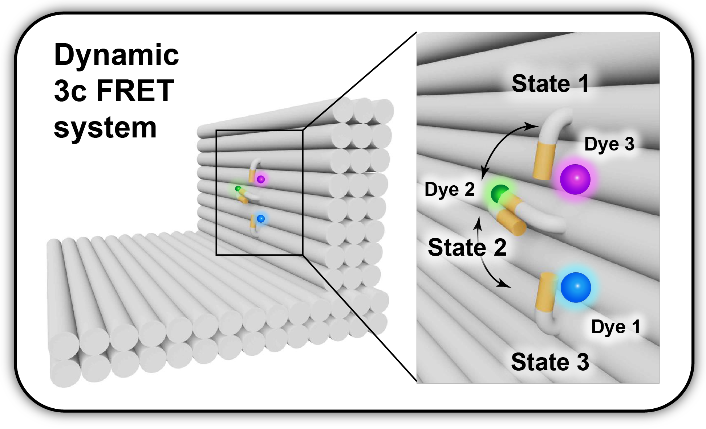

   L-shaped DNA origami structure labeled with Atto 488, Cy3B, and Atto647N. The yellow dye is attached to a tether that can freely bind to any of the three binding strands. 

.. _data-prep_3c:
Data preparation 
~~~~~~~~~~~~~~~~~~~~~~~~~~~~~~~~~~~~~~

The origami structures were measured on a smTIRF microscope with three separate EMCCD cameras, one for each fluorescent dye on the sample. ALEX was used to excite the three fluorophores alternatively at an exposure time of 50 ms, also the frame transfer time of the cameras was set to 2.2 ms. The resulting data would then be videos of consecutive frames from each channel with *.tif* file format. You can find a couple of example data files on `Zenodo <https://zenodo.org/record/1249497#.Y_D1bnaZPmk>`_.

.. _localization_3c:
Co-Localization of Molecules 
~~~~~~~~~~~~~~~~~~~~~~~~~~~~~~~~~~~~~~

When using three separate cameras like the example described here, there might be the chance of some discrepancy among the cameras’ fields of view resulting from aberrations or cameras misalignment. To make sure that triple-labeled species are detected, a correct linking of same molecule emitters across the detection channels is needed. DeepLASI makes a coordinate transformation map to get rid of any potential difference.

Mapping the three channels is quite similar to the two-channel procedure. In order to map all cameras, please follow the steps explained in the section :ref:`mapping` , because the necessary workflow for loading the ZMW images are the same. The difference would be that you do not need to flip the image from the second (green) camera (as you would clearly recognize by looking at its image pattern), and you need to continue loading the ZMW image also from the third channel (now with horizontal flipping). We loaded the ZMW image from the blue channel through :code:`File > Mapping > Create New Map > 1st channel`. On the opened window, we clicked on *Full* and *OK*. We took similar steps to open the ZMW image from the green and red cameras. So after loading the file from second channel via :code:`File > Mapping > Create New Map > 2nd channel`, and checking the pattern on the preview, we clicked on *Full*, and confirmed. The image from red camera was opened via :code:`File > Mapping > Create New Map > 3rd channel`, after clicking on *Full*, *Horizontal Flip*, and *OK*, we got ZMW images viewd on corresponding channels (:numref:`three zmw loaded`). If you have loaded the mapping images correctly, you will see the three panels similar to :numref:`three zmw loaded`. Then you can click on *Start Mapping* like we did. Please also follow the final steps in :ref:`mapping` to check the mapping quality and save the created map.     

.. figure:: ./../../figures/examples/1_3c_three_zmw_loaded.png
   :width: 500
   :alt: 3_zmw loaded
   :align: center
   :name: three zmw loaded
   
   The loaded ZMW images from all three cameras in the mapping tab 

..  _loading-data_3c:
Loading the Data
~~~~~~~~~~~~~~~~~~~~~~~~~~~~~~~~~~~~~~

After having the cameras mapped with respect to the first channel, we continued with loading the data files. Similar to the mapping step, loading the raw data from three cameras is similar to that from two cameras with some little differences that are explained here. To see how to load the data please first check the section :ref:`loading-data_2c_d`. After selecting all the data files, on the first *Measurement Parameters* window opened, we first filled in the boxes like :numref:`3c_measurement_parameters1` to clarify the experimental details. The *Interframe time* is still 52.2 ms. The ALEX sequence is BGR in the current example because the three lasers were alternating one after another. Then we set the slider to the very left side to determine the first detection channel. After selecting the desired frame range, we clicked on **B** for the detection color.

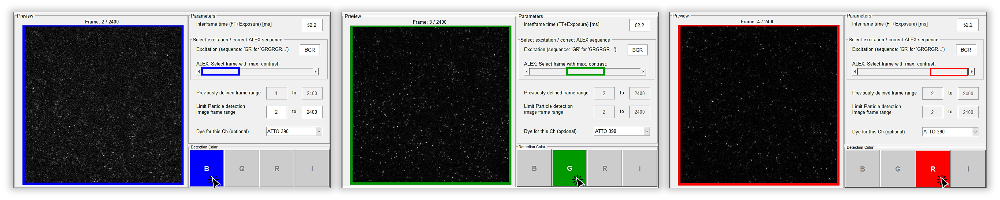
   
   Setting the measurement parameters to load the data from the first (blue) channel  

Then on the *Extraction* tab the detected particles will be marked inside blue triangles. We continued with loading the data files from the second and third channels followed by moving the slider on the *Measurement Parameters* window one step to the right each time, and also choosing the proper detection color, meaning clicking on **G** and **R** with the corresponding position of the slider (middle and most right respectively). The detected particles across each channel will be inside triangles with matching colors to the channels, and all the co-localized ones will be inside white circles representing the structures with all three dyes on them, :numref:`3c_all_particle_detected`.  

.. figure:: ./../../figures/examples/3_3c_all_particle_detection.png
   :width: 700
   :alt: 3c_particle_detection
   :align: center
   :name: 3c_all_particle_detected
   
   Particles detected from the first data file on all three cameras and the co-localizations 

..  _extraction_3c:
Trace Extraction
~~~~~~~~~~~~~~~~~~~~~~~~~~~~~~~~~~~~~~

In order to extract the traces, we continued like the section :ref:`extraction_2c_d`, with the only difference in the *Frame Selection* part, that we left it to be from 2 to 3000, and in total 7990 traces were extracted. An example of the extracted traces is shown on :numref:`3c_trace_n2665`. Here you can see three panels, the upper two ones are fluorescence intensity traces, and the lowest one is the trace of FRET efficiency.

.. figure:: ./../../figures/examples/4_3c_trace_2665.png
   :width: 750
   :alt: 3c trace look
   :align: center
   :name: 3c_trace_n2665 
   
   Exemplary trace for a three-color smTIRF measurement

The first panel shows the intensity traces from all channels after blue laser excitation. The gray line is the total intensity in the blue channel, the dark blue is the blue dye emission after blue excitation, the light blue shows the yellow dye emission (BY FRET), and the pink is the red dye emission (BR FRET) all after blue excitation. The second panel shows the intensity traces from green and red channels after corresponding laser excitations. So again, the gray trace is the total intensity in the green channel, the green one is the yellow dye emission, and the orange is the red dye emission both after yellow laser excitation. The red trace is the red dye fluorescence after red excitation. Also the FRET efficiency traces are shown on the last panel in blue for the BY, orange for the YR, and pink for the BR FRET pairs.

..  _manual_3c:
Manual data analysis and correction
~~~~~~~~~~~~~~~~~~~~~~~~~~~~~~~~~~~~~~

For a detailed description of manual analysis steps please see the section :ref:`manual_2c_d`. The analysis steps are mostly the same, and if there is any special case for the three-color data, it will be explained here, otherwise the final results will be shown. As explained for the two-color data, you can select the active region for each dye on each trace by pressing 1, 2, and 3 because of having three individual channels now, and then drag the cursor to select the desired region. You can see an example of a 3C trace with the regions selected on the upper two panels on :numref:`3c_trace_regions`. The FRET efficiency trace is automatically shadowed during the time range that all the three dyes are active. Pressing the *E* key also works for region selection and categorization by the program.  

.. figure:: ./../../figures/examples/5_3c_trace_regions.png
   :width: 750
   :alt: 3c trace selection
   :align: center
   :name: 3c_trace_regions 
   
   Selected regions on the intensity and FRET efficiency traces for the example trace shown above 

After categorization of all traces, we continued with plotting the FRET efficiencies for each dye pair on the origami structure, and also extracted the dynamic information of the system. :numref:`3c_trace_regions` shows the apparent and corrected FRET efficiencies for each dye pair (BY, BR, and YR) with the fitting results. 

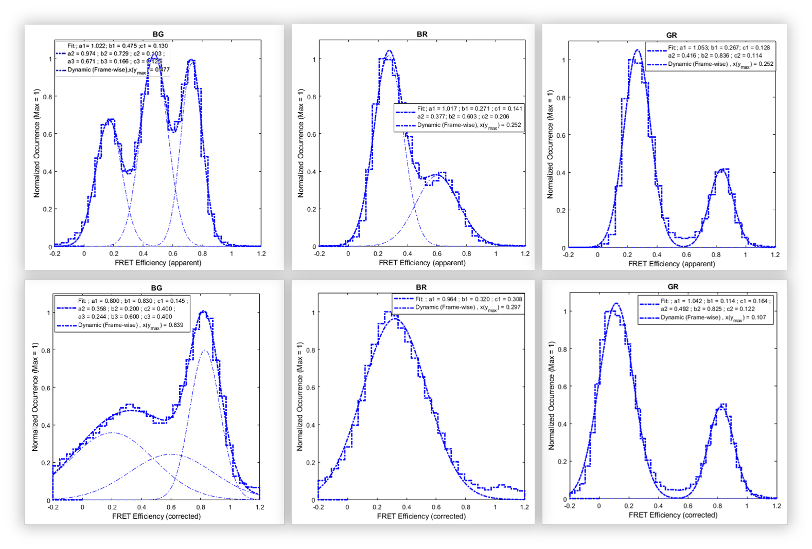
   
   Apparent FRET efficiency (top row), and corrected FRET efficiency histograms with the fitting result

The HMM tab on the DeepLASI works properly for the two-color data. In the case of three-color data, we can get the dynamic results from the neural network inserted in the program, so you can see the resulting kinetic information on the automatic analysis section which follows. 

..  _automatic_3c:
Automatic data analysis and correction
~~~~~~~~~~~~~~~~~~~~~~~~~~~~~~~~~~~~~~

In the following section you can see the automated analysis steps for dynamic 3-color smFRET data. This part is also very similar to the section :ref:`automatic_2c_d`, so please have a look at that part first, and try to take the similar steps to analyze the current data. Although, any difference between the 2 and 3 color cases will be explained here.

So, we first load the extracted traces to be analyzed. To start the automatic analysis, we first clicked on the button *Deep Learning*. You can now click on *Magic Button*, or perform the automatic analysis in several separate steps. For the latter case, the program will ask you to choose the neural network model like :numref:`3c_categorization_model`. As shown on the figure, we selected the *3-color ALEX* and clicked on *OK*.

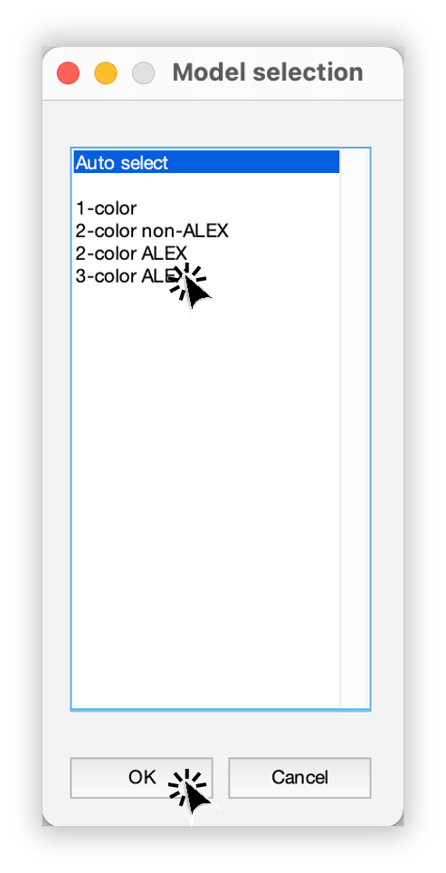
   
   Model selection window to specify the fitting neural network to the data
   
..  _summary_3c:
Plotting and Summary of Results
~~~~~~~~~~~~~~~~~~~~~~~~~~~~~~~~~~~~~~

In this section, the resulting graphs and information after the automatic analysis by the DeepLASI are listed and shown.

One of the first results that DeepLASI reports is the confidence level in predicting the number of states in the traces, as you can see for the current data on :numref:`3c_confidence level`. 

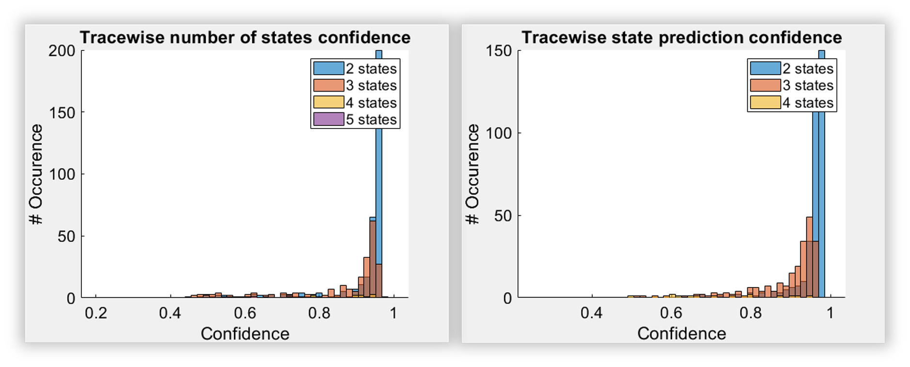
   
   The confidence level histogram for the number of states (left) and the states prediction (right)

The resulting histograms of the apparent FRET efficiency to give a quick overview of the existing FRET population(s) for each pair is shown on :numref:`3c apparent fret`. It is the mean FRET efficiency observed on the states found along the traces.

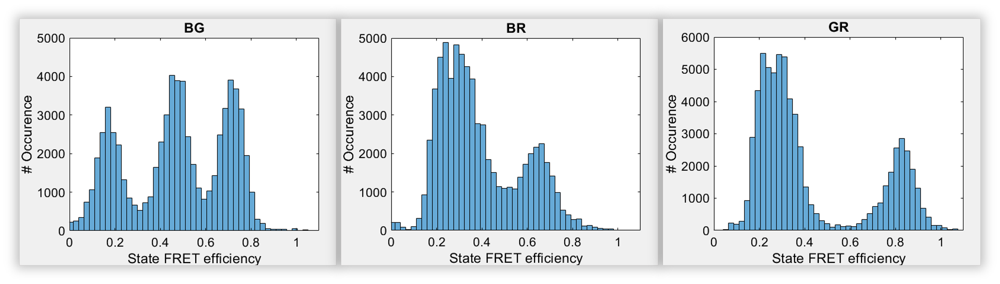
   
   The histograms of apparent FRET efficiency averaged for each state, labeled for each FRET pair

To generate the TDP plot, on the window like :numref:`3c_TDP_generating_option` popping up to take in the desired number of bins and confidence threshold from the user. We left the number of bins to 100 and the threshold on 0, selected the *3 states*, and then clicked on *Generate Transition Density Plot*.

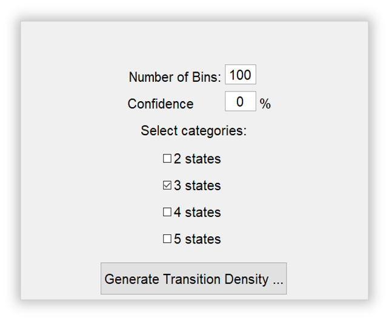
   
   The GUI asking for TDP options

As you can see on :numref:`3c_TDPs_generated`, the TDP for each dye pair is generated. We can easily select any desired cluster among all the transitions to extract the rates or dwell time information. 

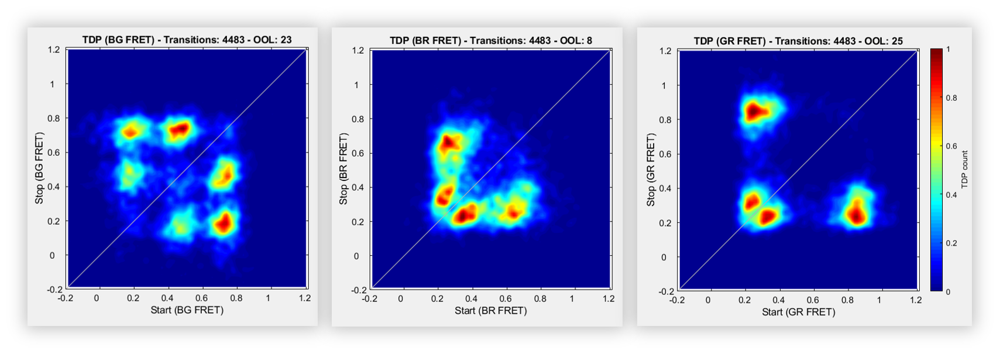
   
   The generated TDP opened in separated windows for the existing FRET pairs

You can see an example of the kinetic information extracted for the YR FRET pair on :numref:`3c_YR_dwell_time` with the selected cluster on the right side of the graph. The fitted dwell time for these transitions is calculated as 0.67 s.

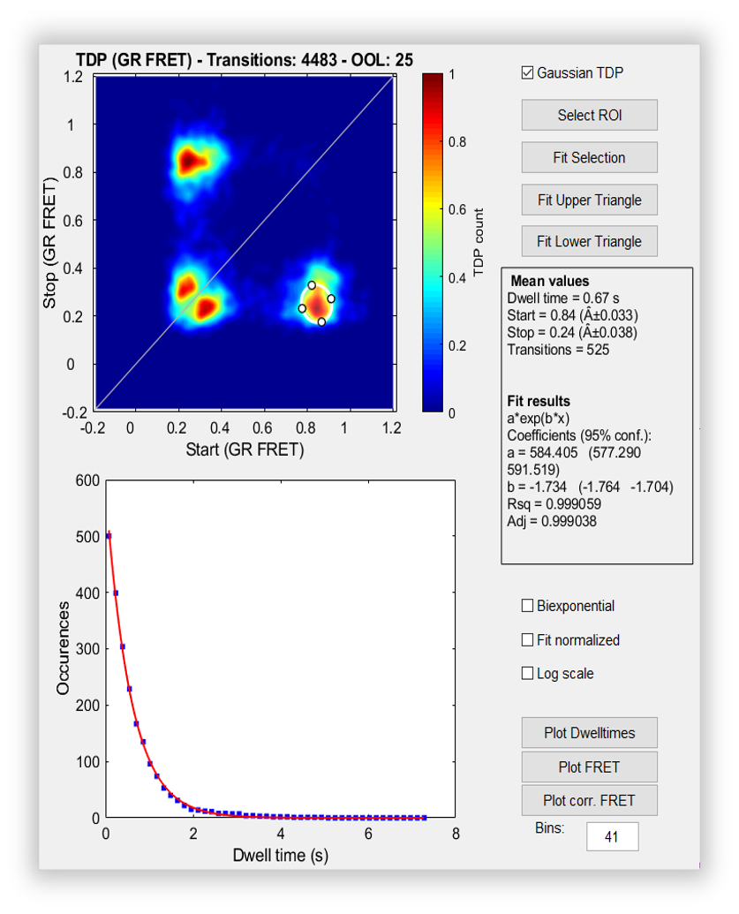
   
   Selected TDP cluster to achieve live fitting results

In the end, all correction factors are plotted as histograms with their mean, median, and mode values reported on them. As you can see on :numref:`3c_de_ct` and :numref:`3c_gamma_factor`, the moleculewise direct excitation, spectral crosstalk, and gamma factor are shown. The statistical information about them are also presented.

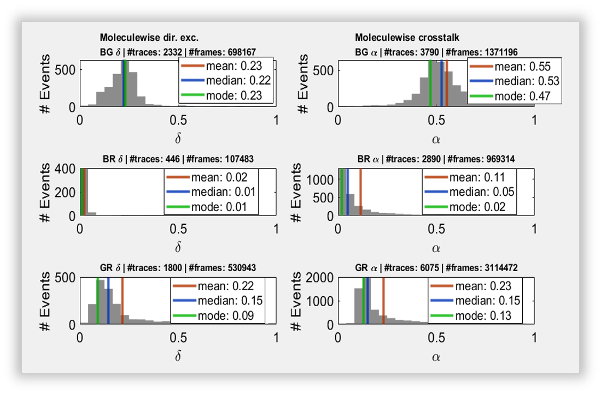
   
   The histograms of direct excitation and spectral crosstalk correction factors reported with statistics

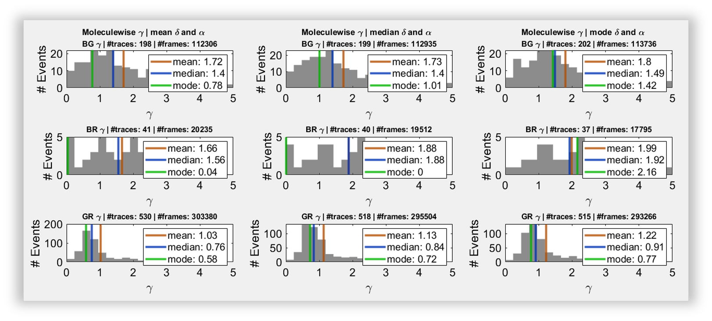
   
   The histograms of detection efficiency correction factor reported with statistics
   
