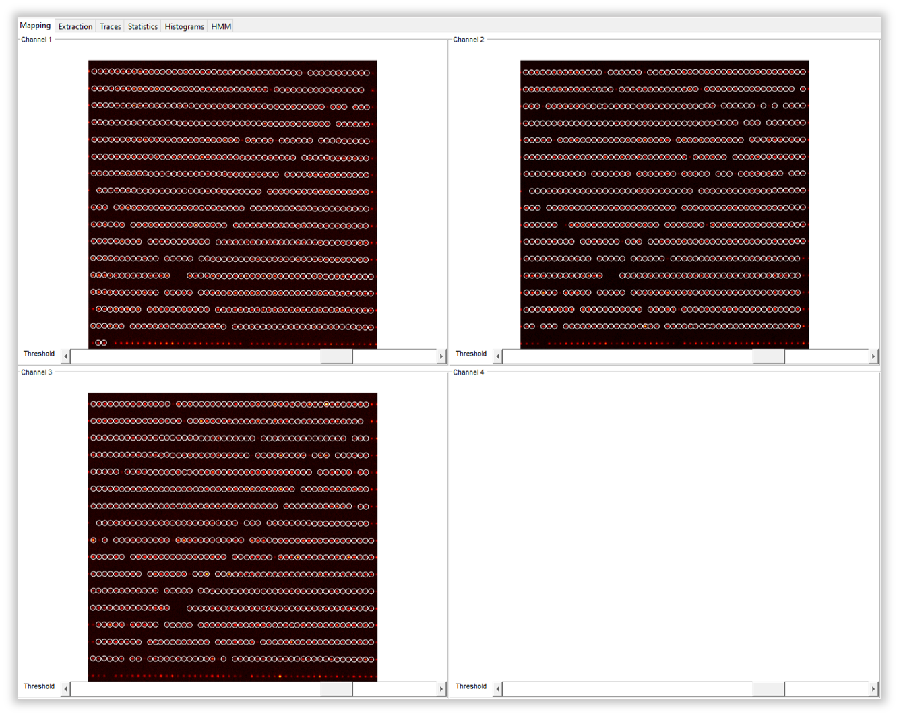

.. |br| raw:: html

    

.. _dynamic-3c:

Dynamic 3c FRET Data
=====

Here you can see how to use DeepLASI to analyze dynamic 3-color smFRET (single-molecule Förster Resonance Energy Transfer) data measured with alternating laser excitation (ALEX). DeepLASI provides you with the options of analyzing your data either manually or automatically using the deep learning neural network. The analysis usually starts with detecting the co-localized FRET pairs within the field of view from all cameras and extracting their intensity traces, followed by sorting the traces into helpful categories, and determining the correction factors. Afterwards, you can continue the analysis steps for the kinetics of the sample system and visualize the whole data on various plots and histograms.

The following part shows all the steps to analyze dynamic 3C smFRET data from L-shaped DNA origami structures with three FRET states. The example data together with further data sets are accessible in `Wanninger et al., BioArxiv (2023) <https://doi.org/10.1101/2023.01.31.526220>`_.

Overview - Example
------------------
- :ref:`example-data_3c`
- :ref:`data-prep_3c`
- :ref:`localization_3c`
- :ref:`loading-data_3c`
- :ref:`extraction_3c`
- :ref:`manual_3c`
- :ref:`automatic_3c`
- :ref:`summary_3c`

--------------------------------------------------------------------

Example
-----------

..  _example-data_3c:
Sample Design: Dynamic L-Shaped DNA Origami
~~~~~~~~~~~~~~~~~~~~~~~~~~~~~~~~~~~~~~

The described data set is from smTIRF measurement with DNA origami structure as you can see on :numref:`FIGURE`. The origami is labeled with Atto 488 (donor), Cy3B (donor/acceptor), and Atto647N (acceptor). The yellow dye (Cy3B) is attached to the flexible tether binding freely among three single-stranded binding sites, with 7 nt overhang on both 6 and 12 o'clock binding positions, and a 8 nt, 1 mismatch overhang on the 9 o'clock position. The energy transfer is expected to be distributed within a high, medium, and low FRET for each dye pair of blue/yellow and yellow/red. However, the FRET between blue/red pair is expected to be static because both dyes are attached directly to the origami.

FIGURE. L-shaped DNA origami structure labeled with Atto 488, Cy3B, and Atto647N. The yellow dye is attached to a tether that can freely bind to any of the three binding strands. 

.. _data-prep_3c:
Data preparation 
~~~~~~~~~~~~~~~~~~~~~~~~~~~~~~~~~~~~~~

The origami structures were measured on a smTIRF microscope with three separate EMCCD cameras, one for each fluorescent dye on the sample. ALEX was used to excite the three fluorophores alternatively at an exposure time of 50 ms, also the frame transfer time of the cameras was set to 2.2 ms. The resulting data would then be videos of consecutive frames from each channel with .tif file format. You can find a couple of example raw data on Zenodo.

.. _localization_3c:
Co-Localization of Molecules 
~~~~~~~~~~~~~~~~~~~~~~~~~~~~~~~~~~~~~~

When using three separate cameras like the example described here, there might be the chance of some discrepancy among the cameras’ fields of view resulting from aberrations or cameras misalignment. To make sure that tripple-labeled species are detected, a correct linking of same molecule emitters across the detection channels is needed. DeepLASI makes a coordinate transformation map to get rid of any potential difference.

Mapping the three channels are quit similar to the two-channel situation. In order to map all cameras, please follow the steps explained in the section **Co-Localization of Molecules, 2c-FRET-Dynamic, linking** , because the necessary workflow for loading the ZMW images are the same untill :numref:`map image flipping`. The difference would be that you do not need to flip the image from the second camera (as you would clearly recognize by looking at it), and you need to continue loading the ZMW image also from the third channel (now with horizontal flipping). If you have loaded the mapping images correctly, you will see the three panels similar to :numref:`three zmw loaded`. Then you can click on *Start Mapping* like we did. Please also follow the final steps in **Co-Localization of Molecules, 2c-FRET-Dynamic, linking** to check the mapping quality and save the created map.     

   
   The loaded ZMW images from all three cameras in the mapping tab 

..  _loading-data_3c:
Loading the Data
~~~~~~~~~~~~~~~~~~~~~~~~~~~~~~~~~~~~~~

After having the cameras mapped with respect to the first channel, we continued with loading the data files. Like mapping step, loading the raw data from three cameras is similar to that from two cameras with some little difference that are explained here. 

..  _extraction_3c:
Trace Extraction
~~~~~~~~~~~~~~~~~~~~~~~~~~~~~~~~~~~~~~

..  _manual_3c:
Manual data analysis and correction
~~~~~~~~~~~~~~~~~~~~~~~~~~~~~~~~~~~~~~

..  _automatic_3c:
Automatic data analysis and correction
~~~~~~~~~~~~~~~~~~~~~~~~~~~~~~~~~~~~~~

..  _summary_3c:
Plotting and Summary of Results
~~~~~~~~~~~~~~~~~~~~~~~~~~~~~~~~~~~~~~

