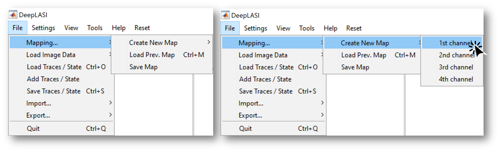

.. |br| raw:: html

    

.. _dynamic-3c:

Dynamic 3c FRET Data
=====

Here you can see how to use DeepLASI to analyze dynamic 3-color smFRET (single-molecule Förster Resonance Energy Transfer) data measured with alternating laser excitation (ALEX). DeepLASI provides you with the options of analyzing your data either manually or automatically using the deep learning neural network. The analysis usually starts with detecting the co-localized FRET pairs within the field of view from all cameras and extracting their intensity traces, followed by sorting the traces into helpful categories, and determining the correction factors. Afterwards, you can continue the analysis steps for the kinetics of the sample system and visualize the whole data on various plots and histograms.

The following part shows all the steps to analyze dynamic 3C smFRET data from L-shaped DNA origami structures with two (or three?) FRET states. The example data together with further data sets are accessible in Wanninger et al., BioArxiv (2023).

Overview - Example
------------------
- :ref:`example-data_3c`
- :ref:`data-prep_3c`
- :ref:`localization_3c`
- :ref:`extraction_3c`
- :ref:`manual_3c`
- :ref:`automatic_3c`
- :ref:`summary_3c`

--------------------------------------------------------------------

Example
-----------

..  _example-data_3c:
Sample Design: Dynamic L-Shaped DNA Origami
~~~~~~~~~~~~~~~~~~~~~~~~~~~~~~~~~~~~~~

.. _data-prep_3c:
Data preparation 
~~~~~~~~~~~~~~~~~~~~~~~~~~~~~~~~~~~~~~

.. _localization_3c:
Co-Localization of Molecules 
~~~~~~~~~~~~~~~~~~~~~~~~~~~~~~~~~~~~~~

   
   Mapping steps on DeepLASI for loading the first channel image

..  _extraction_3c:
Trace Extraction
~~~~~~~~~~~~~~~~~~~~~~~~~~~~~~~~~~~~~~

..  _manual_3c:
Manual data analysis and correction
~~~~~~~~~~~~~~~~~~~~~~~~~~~~~~~~~~~~~~

..  _automatic_3c:
Automatic data analysis and correction
~~~~~~~~~~~~~~~~~~~~~~~~~~~~~~~~~~~~~~

..  _summary_3c:
Plotting and Summary of Results
~~~~~~~~~~~~~~~~~~~~~~~~~~~~~~~~~~~~~~

