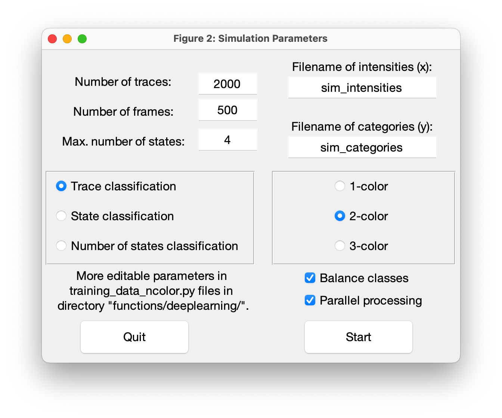
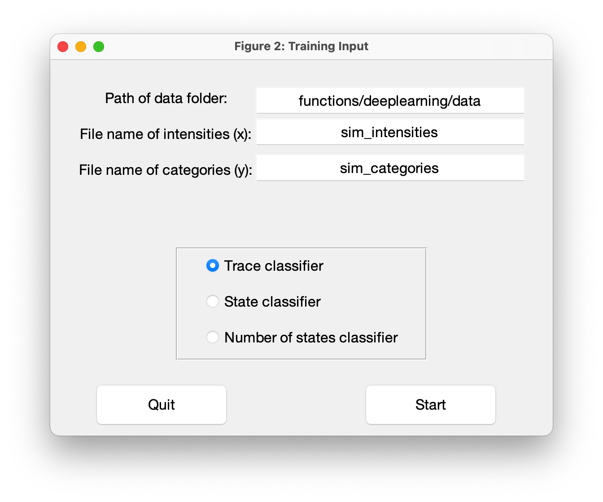

Simulations
=====

Simulating traces and training of deep neural networks is not supported in the standalone version of DeepLASI.
Please refer to the :doc:`installation` guide for the required python packages.

.. _sim:

Simulation of Traces
------------

In the top bar of DeepLASI, click on 'Tools' and 'Simlate Data'. The following input dialog will open:

   
You can choose the total number traces to be simulated (before balancing), the trace length (number of frames) and the maximum number of states, which is especially important when training new state classifiers. The generated intensities and the corresponding categories are saved separately in two files. For every type of classifier you can select the number of colors/channels to be generated. Note that intensities simulated for state classification and number of states classification do not include bleaching or any other type of 'trash' categories. For more control over the training set or if you want to simulate a specific system you can edit the simulation parameters in the training data .py files. A GUI option will be available in the future.

Training new neural network models
------------

After generating simulated data sets you can start training new classifiers. In the top bar of DeepLASI, click on 'Tools' and 'Train'. The following input dialog will open:

   
Enter the path and filenames of the simulated intensities and categories, choose the appropriate model for the training data set and start training.
Training parameters can be edited in '/functions/deeplearning/model_training_from_MATLAB.py'. A GUI option will be available in the future.
